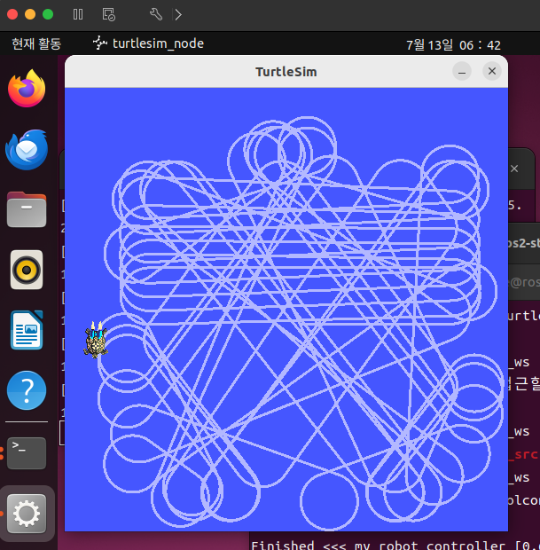
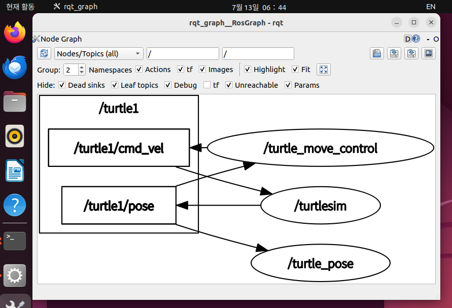

# 문제10 — 게시자와 구독자를 함께 사용한 폐쇄 루프 제어

## 1. 목표

turtlesim의 로봇(거북이)이 벽에 충돌하지 않고 계속 움직이도록 하는 제어 노드
`turtle_move_control`을 작성한다. 이 노드는 하나의 노드 안에 **서브스크라이버와
퍼블리셔를 동시에** 가지며, 다음과 같은 폐쇄 루프(closed loop)를 구성한다.

```
turtle_move_control ──(발행: /turtle1/cmd_vel)──▶ turtlesim
        ▲                                            │
        └────────(구독: /turtle1/pose)◀──────────────┘
```

명령을 보내면 로봇이 움직이고, 움직인 결과(위치)가 다시 돌아와 다음 명령을
결정한다. 실제 라인트레이서 운반 로봇에서 모터 명령 → 주행 → IR 센서 값 →
명령 보정으로 이어지는 구조와 동일하다.

## 2. 제어 노드 구현 (`turtle_move_control.py`)

```python
import rclpy
from rclpy.node import Node
from turtlesim.msg import Pose
from geometry_msgs.msg import Twist


class TurtleMoveControl(Node):
    def __init__(self):
        super().__init__('turtle_move_control')
        self.margin = 2.0     # 벽에서 이 거리 안으로 들어오면 "위험"으로 판정
        self.wall = 11.09     # turtlesim 좌표계의 벽 위치 (0 ~ 11.09)
        self.subscription = self.create_subscription(
            Pose, '/turtle1/pose', self.pose_callback, 10)   # 구독자
        self.publisher = self.create_publisher(
            Twist, '/turtle1/cmd_vel', 10)                   # 발행자

    def pose_callback(self, msg):
        cmd = Twist()
        if msg.x < self.margin or msg.x > self.wall - self.margin or \
           msg.y < self.margin or msg.y > self.wall - self.margin:
            cmd.linear.x = 1.0      # 위험: 천천히 전진하며
            cmd.angular.z = 1.5     #       왼쪽으로 곡선 회전
        else:
            cmd.linear.x = 2.0      # 안전: 직진
            cmd.angular.z = 0.0
        self.publisher.publish(cmd)


def main(args=None):
    rclpy.init(args=args)
    node = TurtleMoveControl()
    rclpy.spin(node)
    rclpy.shutdown()


if __name__ == '__main__':
    main()
```

### 동작 원리

- turtlesim이 발행하는 `/turtle1/pose`(현재 위치·방향)를 구독하고, 위치가 갱신될
  때마다 `pose_callback`이 호출된다.
- 콜백 안에서 현재 좌표가 벽에서 `margin`(2.0) 이내인지 판정한다.
  - **위험 구역**: 전진 속도를 줄이고(`linear.x = 1.0`) 왼쪽으로 회전
    (`angular.z = 1.5`)해 곡선을 그리며 벽에서 벗어난다.
  - **안전 구역**: 회전 없이 직진한다(`linear.x = 2.0`).
- 판정 결과를 `/turtle1/cmd_vel`로 발행하면 turtlesim이 그 속도로 움직이고,
  바뀐 위치가 다시 구독으로 돌아온다 — 이것이 폐쇄 루프다.

### 지시서에 없는 사항에 대한 가정 (자유 구현 부분)

- 회전 방향은 항상 왼쪽(반시계, `angular.z > 0`)으로 고정했다.
- 위험 판정 여유(margin)는 2.0으로 정했다. 직진 속도 2.0에서 곡선을 그리며
  빠져나오기에 충분한 값을 실험적으로 선택한 것이다.

## 3. 노드 등록 (`setup.py`)

`entry_points`의 `console_scripts`에 실행 이름을 등록해야 `ros2 run`이 노드를
찾을 수 있다. 형식은 `'실행이름 = 패키지.파일:main'`이다.

```python
entry_points={
    'console_scripts': [
        'logging_node        = my_robot_controller.logging:main',
        'timer_node          = my_robot_controller.timer_test:main',
        'circle_turtle       = my_robot_controller.circle_turtle:main',
        'turtle_pose         = my_robot_controller.turtle_pose:main',
        'turtle_move_control = my_robot_controller.turtle_move_control:main',
    ],
},
```

## 4. 빌드 및 실행

```bash
cd ~/ros2_ws                           # 워크스페이스 최상위에서
colcon build                           # 빌드 (entry_points 수정 반영)
source ~/ros2_ws/install/setup.bash    # 빌드 결과물을 현재 터미널에 적용
```

```
Starting >>> my_robot_controller
Finished <<< my_robot_controller [0.63s]

Summary: 1 package finished [0.92s]
```

turtlesim을 먼저 띄운 뒤 제어 노드를 실행한다 (터미널마다 `source` 필요):

```bash
ros2 run turtlesim turtlesim_node            # 터미널 1
ros2 run my_robot_controller turtle_move_control   # 터미널 2
```

이때 실행 이름은 파일명(`turtle_move_control.py`)이 아니라 `console_scripts`에
등록한 이름이다. 파일명으로 실행하면 `No executable found` 에러가 난다.

정리하면 새 노드를 만들 때마다 반복하는 사이클은:
**작성 → 등록(entry_points) → 빌드(colcon build) → 적용(source) → 실행(ros2 run)**

## 5. 실행 결과

### 주행 궤적 (`turtlesim_wall_avoidance.png`)



화면 가운데에서는 직선 궤적, 벽 근처에서는 곡선을 그리며 방향을 바꾼 궤적이
보인다. 장시간 실행해도 벽에 충돌해 멈추지 않고 계속 주행한다.

### 노드/토픽 그래프 (`rqt_graph_turtle_move_control.png`)



`/turtle_move_control`에서 `/turtle1/cmd_vel`로 나가는 화살표(발행)와
`/turtle1/pose`에서 들어오는 화살표(구독)가 동시에 보인다 — 한 노드가
퍼블리셔와 서브스크라이버를 모두 가진 폐쇄 루프 구조의 확인이다.
(그래프의 `/turtle_pose` 노드는 문제9에서 만든 노드가 함께 실행 중이던 것으로,
문제10의 제어 루프와는 무관하다.)

## 6. 산출물

| 파일                                  | 내용                                     |
| ------------------------------------- | ---------------------------------------- |
| `10_closed_loop.md`                 | 본 문서                                  |
| `my_robot_ws.tar.gz`                | 워크스페이스 소스 (`ros2_ws/src`) 압축 |
| `rqt_graph_turtle_move_control.png` | 노드/토픽 구조 그래프                    |
| `turtlesim_wall_avoidance.png`      | 벽 회피 주행 궤적 화면                   |
