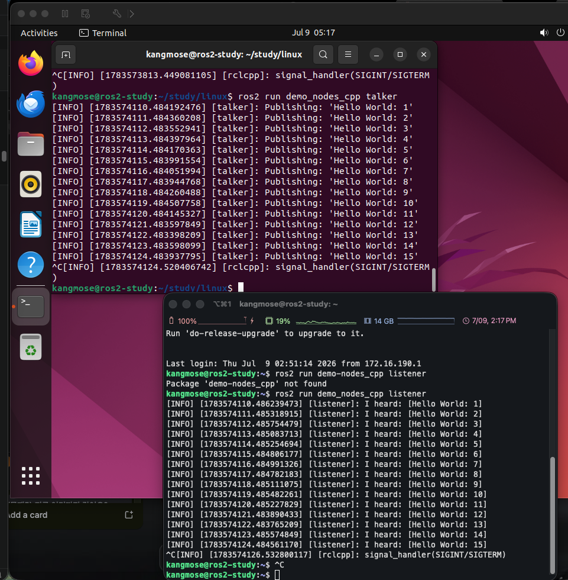

# 로봇이 동작하는 가상세계 — ROS2 설치 및 talker/listener 실습 (문제2)

---

## 1. 로봇 운영체제 개념

컴퓨터의 운영체제(우분투)는 CPU·메모리·디스크 같은 하드웨어 자원을 여러 프로그램이 나눠 쓸 수 있게
관리하고, 프로그램 간 통신 방법을 제공한다. **로봇 운영체제(ROS2)도 동일한 문제를 로봇 영역에서
해결한다.**

로봇의 "하드웨어"는 모터, 카메라, IR 센서, 라이다 등이고, "프로그램"은 "센서 값을 읽는다",
"모터를 구동한다" 같은 독립적인 기능들이다. ROS2는 이런 **하드웨어 자원을 여러 기능(노드)이 나눠
쓸 수 있게 하고, 그 기능들 사이의 통신(메시지 전달)을 대신 처리해주는 소프트웨어 계층**이다.

## 2. OS 유무에 따른 로봇 차이

| 구분 | 운영체제 없이 개발 | ROS2(운영체제) 사용 |
|------|---------------------|----------------------|
| 코드 구조 | 모든 기능을 한 프로그램 안에 순서대로 작성 | 기능 단위로 독립된 노드로 분리 |
| 유지보수 | 센서 하나 바꿔도 전체 코드를 다시 손봐야 할 수 있음 | 해당 노드만 수정하면 됨 |
| 협업 | 코드가 뒤섞여 여러 명이 나눠 작업하기 어려움 | 노드 단위로 역할을 나눠 개발 가능 |
| 노드 간 통신 | 통신 규약을 직접 설계·구현해야 함 | ROS2가 통신(퍼블리시/구독)을 대신 처리 |

**가정**: 라인트레이싱 운반 로봇을 예로 들면, "IR 센서로 선을 읽는 기능", "모터 제어값을 계산하는
기능", "실제로 모터를 구동하는 기능"을 ROS2 없이 하나의 프로그램에 합쳐서 짤 수도 있지만, ROS2를
쓰면 각각을 독립 노드로 분리해 개발·교체할 수 있다.

## 3. ROS2 Humble 설치 절차

개발환경: Ubuntu 22.04.5 arm64 (VMware Fusion VM)

### 3.1 사전 준비 — Universe 저장소 활성화

```bash
sudo apt install software-properties-common
sudo add-apt-repository universe
```

우분투 기본(main) 저장소에는 ROS2가 의존하는 일부 패키지가 없어 Universe 저장소를 먼저 켜야 한다.

### 3.2 ROS2 GPG 키 및 apt 저장소 등록

우분투 기본 저장소에는 ROS2 패키지 자체가 없으므로, ROS 전용 apt 저장소를 추가로 등록해야 한다.
신뢰할 수 있는 저장소인지 검증하기 위해 GPG 키도 함께 등록한다.

```bash
sudo apt update && sudo apt install curl -y
sudo curl -sSL https://raw.githubusercontent.com/ros/rosdistro/master/ros.key \
  -o /usr/share/keyrings/ros-archive-keyring.gpg

echo "deb [arch=$(dpkg --print-architecture) signed-by=/usr/share/keyrings/ros-archive-keyring.gpg] \
http://packages.ros.org/ros2/ubuntu $(. /etc/os-release && echo $UBUNTU_CODENAME) main" \
  | sudo tee /etc/apt/sources.list.d/ros2.list > /dev/null
```

등록 결과 (`/etc/apt/sources.list.d/ros2.list`):

```
deb [arch=arm64 signed-by=/usr/share/keyrings/ros-archive-keyring.gpg] http://packages.ros.org/ros2/ubuntu jammy main
```

### 3.3 ROS2 Humble Desktop 설치

```bash
sudo apt update
sudo apt upgrade -y
sudo apt install ros-humble-desktop -y
```

`ros-humble-desktop`은 ROS2 핵심 도구, RViz(시각화 도구), 데모 패키지(`demo_nodes_cpp` 포함)까지
포함하는 전체 패키지다.

### 3.4 환경설정 및 확인

```bash
source /opt/ros/humble/setup.bash
echo $ROS_DISTRO
```

```
humble
```

`humble`이 출력되어 설치가 정상 완료됐음을 확인했다.

## 4. 패키지와 노드의 관계

- **패키지(package)**: 관련된 기능들을 묶어놓은 단위. 예: `demo_nodes_cpp` 패키지 안에 talker,
  listener 등 여러 데모 프로그램이 들어있다.
- **노드(node)**: 패키지 안에서 실제로 실행되는 개별 프로그램 하나. 하나의 패키지에 여러 노드가
  포함될 수 있다.

비유하면 **패키지 = 앱(App)**, **노드 = 그 앱을 실행했을 때 뜨는 개별 프로세스**에 해당한다.

## 5. `ros2 run` 사용법

```
ros2 run <패키지 이름> <노드 이름>
```

하나의 패키지 안에 노드가 여러 개 있을 수 있으므로, "어느 패키지의, 어느 노드"인지 둘 다 지정해야
실행할 대상이 하나로 특정된다.

예시:

```bash
ros2 run demo_nodes_cpp talker
```

```
[INFO] [...] [talker]: Publishing: 'Hello World: 1'
[INFO] [...] [talker]: Publishing: 'Hello World: 2'
...
```

## 6. talker/listener 동시 실행 및 결과

### 6.1 필요했던 추가 환경설정

`source /opt/ros/humble/setup.bash`로 적용한 ROS2 환경변수는 **그 셸 세션에만 적용되고 다른
세션으로 상속되지 않는다.** 따라서 SSH로 새 터미널을 열 때마다 매번 다시 source 해야 하는데, 이를
자동화하기 위해 `~/.bashrc`에 등록해 새 터미널을 열 때마다 자동으로 환경이 적용되게 했다.

```bash
echo 'source /opt/ros/humble/setup.bash' >> ~/.bashrc
```

이 작업 덕분에 두 번째 터미널을 열었을 때도 별도 조치 없이 바로 `ros2 run`을 사용할 수 있었다.
(만약 이 설정을 하지 않았다면 새 터미널마다 `ros2: command not found` 에러를 겪었을 것이다.)

### 6.2 실행 절차

터미널 1:

```bash
ros2 run demo_nodes_cpp talker
```

터미널 2 (새 SSH 세션):

```bash
ros2 run demo_nodes_cpp listener
```

### 6.3 실행 결과

listener 터미널 출력:

```
[INFO] [1783574110.486239473] [listener]: I heard: [Hello World: 1]
[INFO] [1783574111.485318915] [listener]: I heard: [Hello World: 2]
[INFO] [1783574112.485754479] [listener]: I heard: [Hello World: 3]
...
```

talker가 1초마다 퍼블리시한 "Hello World: N" 메시지를 listener가 실시간으로 구독해 "I heard: [...]"로
출력했다. 두 노드가 ROS2 통신(퍼블리시/구독)을 통해 정상적으로 상호작용함을 확인했다.

두 터미널이 동시에 동작하는 화면 캡처:


