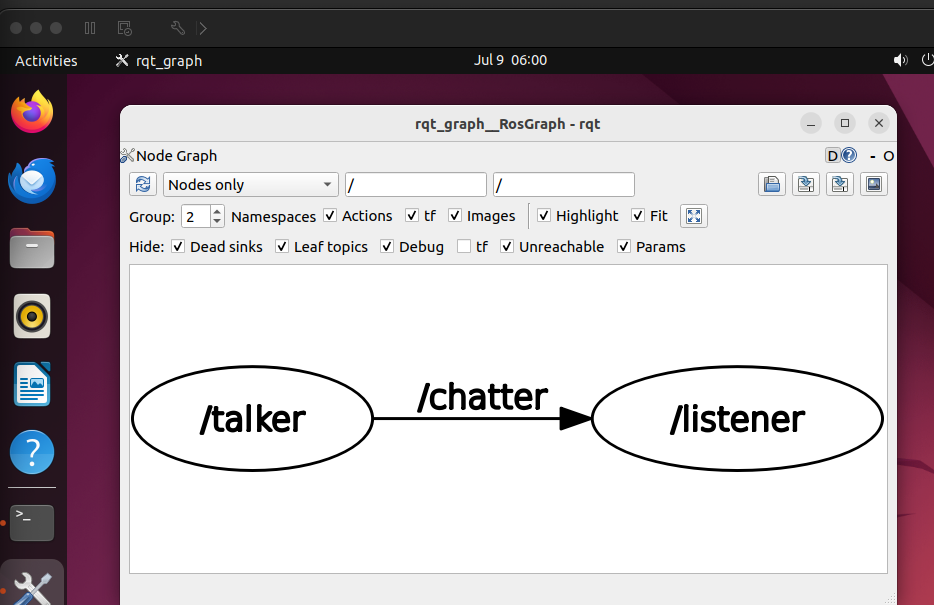
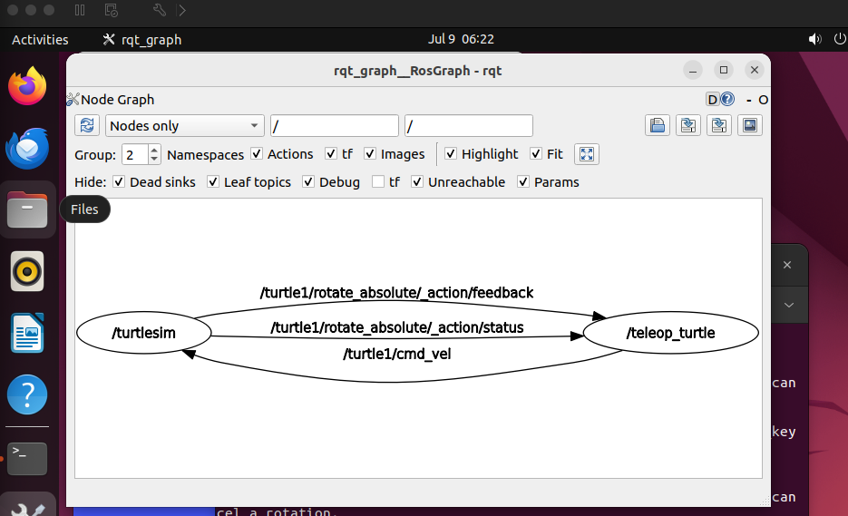

# 실제 로봇에서는 부품, 가상 로봇에서는 노드 (문제3)

---

## 1. 노드(Node)란 무엇인가

실제 로봇은 IR 센서, 모터 드라이버, 배터리 관리 회로 같은 **개별 부품**으로 구성되고, 각 부품은
독립적으로 동작하면서 전선(버스)으로 서로 신호를 주고받는다. ROS2에서 이 "개별 부품"에 대응하는
단위가 **노드**다.

노드는 **독립적으로 실행되는 프로세스**이며, 문제2에서 정리한 패키지/노드 관계를 이어서 보면:

- **패키지**: 노드의 코드가 저장되는 폴더(부품 도면함에 해당)
- **노드**: 그 코드를 실행했을 때 생기는 독립적인 프로세스(실제로 동작 중인 부품에 해당)

노드는 서로 **토픽(topic)**이라는 통로를 통해 메시지를 주고받는다. 부품 비유를 이어가면, 노드가
"부품"이라면 토픽은 부품들을 잇는 "전선"에 해당한다.

## 2. `rqt_graph`로 노드 관계 확인

`rqt_graph`는 노드들이 어떻게 연결돼 있는지(어떤 토픽으로 누가 누구에게 메시지를 보내는지) 그림으로
보여주는 도구다 — 실제 로봇의 회로도에 해당한다. GUI 프로그램이므로 SSH 세션이 아니라 **VM
데스크톱 화면**에서 실행해야 한다 (SSH로 실행 시 `could not connect to display` 에러 발생 — SSH는
텍스트 통신만 하는 통로라 GUI 창을 그릴 화면 정보(`DISPLAY`)가 없기 때문).

### 2.1 talker/listener 관계

```bash
ros2 run demo_nodes_cpp talker      # 터미널 1
ros2 run demo_nodes_cpp listener    # 터미널 2
ros2 run rqt_graph rqt_graph        # 터미널 3 (VM 데스크톱에서)
```

`rqt_graph` 창에서 **"Nodes only"** 모드를 선택하면 아래와 같이 두 노드의 관계가 나타난다.



`/talker`가 `/chatter` 토픽으로 메시지를 publish하고, `/listener`가 그 토픽을 subscribe하는 구조가
화살표 방향으로 표현된다.

### 2.2 `ros2 node list`와의 비교

```bash
ros2 node list
```

```
/listener
/rqt_gui_py_node_17553
/talker
```

**가정 없는 관찰**: `rqt_graph` 화면에는 노드가 2개(`/talker`, `/listener`)만 보였지만,
`ros2 node list`는 3개를 보여준다. 차이는 `/rqt_gui_py_node_17553` 노드다.

- `ros2 run`으로 무언가를 실행하면 그 실행된 프로세스 자체가 하나의 노드로 등록된다.
  `rqt_graph`도 ROS2 프로그램이므로 실행되는 순간 스스로 노드가 되며, 이름 뒤의 숫자는
  프로세스 고유 번호(PID)로 실행할 때마다 자동으로 붙는다.
- `rqt_graph`는 토픽으로 다른 노드와 데이터를 주고받지 않고 ROS2 시스템에 "지금 어떤
  노드/토픽이 있는지" 조회만 하기 때문에, 토픽 연결 기반으로 그리는 그래프 화면에는
  나타나지 않는다.
- 반면 `ros2 node list`는 토픽 연결 여부와 무관하게 **현재 실행 중인 노드 전체**를 나열한다.

즉 그래프와 목록이 정확히 일치하지 않는 이유는 조사 도구(`rqt_graph`) 자신도 하나의 노드로
잡히기 때문이다.

### 2.3 `ros2 node info`로 상세 정보 확인

```bash
ros2 node info /talker
```

```
/talker
  Subscribers:
    /parameter_events: rcl_interfaces/msg/ParameterEvent
  Publishers:
    /chatter: std_msgs/msg/String
    /parameter_events: rcl_interfaces/msg/ParameterEvent
    /rosout: rcl_interfaces/msg/Log
  ...
```

```bash
ros2 node info /listener
```

```
/listener
  Subscribers:
    /chatter: std_msgs/msg/String
    /parameter_events: rcl_interfaces/msg/ParameterEvent
  Publishers:
    /parameter_events: rcl_interfaces/msg/ParameterEvent
    /rosout: rcl_interfaces/msg/Log
  ...
```

`/talker`의 **Publishers**에 `/chatter`가, `/listener`의 **Subscribers**에 `/chatter`가 있는 것이
확인된다 — `rqt_graph`에서 본 talker → `/chatter` → listener 화살표와 동일한 정보를 텍스트로
보여준다. `/parameter_events`, `/rosout`은 `demo_nodes_cpp`가 특별히 만든 것이 아니라 ROS2가 모든
노드에 기본으로 붙여주는 파라미터 관리·로깅용 통신이다.

**참고**: `ros2 node info`는 대상 노드가 실제로 실행 중인 프로세스일 때만 조회할 수 있다. 노드를
Ctrl+C로 종료하면 프로세스가 사라지므로 `Unable to find node` 에러가 발생한다 — 노드는 파일이
아니라 실행 중인 프로세스이기 때문이다.

## 3. `ros2 node` 명령 정리

| 명령 | 기능 |
|------|------|
| `ros2 node list` | 현재 실행 중인 노드 이름을 전부 나열한다 |
| `ros2 node info <노드 이름>` | 특정 노드가 어떤 토픽을 publish/subscribe하는지, 어떤 서비스를 제공하는지 상세히 보여준다 |

## 4. turtlesim 노드 관계

`demo_nodes_cpp`의 talker/listener는 텍스트만 주고받았지만, `turtlesim`은 키보드 입력이 실제
로봇(거북이)의 움직임으로 이어지는 것을 눈으로 확인할 수 있다.

```bash
ros2 run turtlesim turtlesim_node       # 터미널 1
ros2 run turtlesim turtle_teleop_key    # 터미널 2
```

`turtle_teleop_key`를 실행한 터미널에 포커스를 준 상태로 방향키를 누르면 `turtlesim_node`가 띄운
창의 거북이가 움직인다.

### 4.1 두 노드의 관계

talker/listener와 동일한 패턴이 반복된다 — "명령을 만들어내는 쪽"과 "명령을 받아서 반응하는 쪽":

- **`turtle_teleop_key`**: 키보드 입력을 받아 속도 명령을 **publish**한다 (talker 역할)
- **`turtlesim_node`**: 그 명령을 **subscribe**해서 실제로 거북이를 움직인다 (listener 역할)

### 4.2 rqt_graph로 확인



`/turtle1/cmd_vel` 화살표가 `/teleop_turtle → /turtlesim` 방향으로 그려져 있어, 예상한 대로
teleop이 publish, turtlesim이 subscribe함이 확인된다.

그래프에 추가로 보이는 `/turtle1/rotate_absolute/_action/feedback`, `/turtle1/rotate_absolute/_action/status`는
teleop 실행 시 안내된 `G|B|V|C|D|E|R|T` 절대 방향 회전 키 기능을 위한 통신이다. 단순
publish/subscribe보다 확장된 "액션(action)"이라는 통신 방식으로, 요청에 대한 중간 진행 상황
피드백까지 주고받을 수 있는 구조다.

## 5. 정리 — 실제 로봇 부품과 ROS2 노드의 대응

| 실제 로봇 | ROS2 |
|-----------|------|
| 개별 부품(센서, 모터 드라이버 등) | 노드 |
| 부품 간 신호를 전달하는 전선 | 토픽 |
| 회로도 | `rqt_graph` |
| 부품 목록표 | `ros2 node list` |
| 부품 사양서(입출력 핀 정보) | `ros2 node info` |

**가정**: 지시서에 명시되지 않은 세부 사항 중, `rqt_graph`의 "Nodes only" 외 옵션(Group,
Namespaces, Hide 필터 등)은 기본값을 그대로 사용했다. 라인트레이싱 운반 로봇 개발 시에도 센서
노드·제어 노드·모터 구동 노드를 이런 방식으로 분리해 설계하고, `rqt_graph`로 노드 간 연결이
의도대로 구성됐는지 점검할 수 있다.
