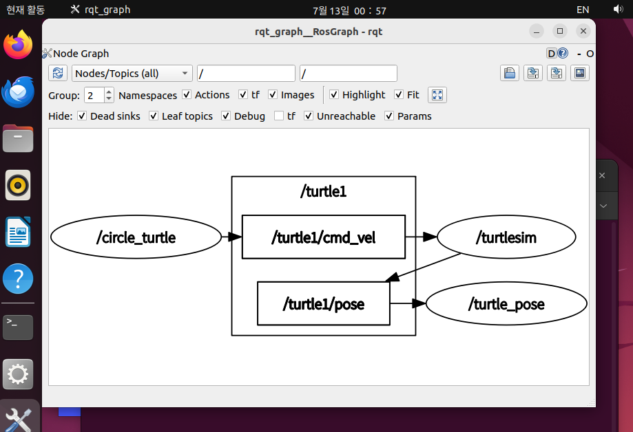

# 문제9: 서브스크라이버 — 누군가는 정보를 받아가고

## 수행 목표

서브스크라이버(subscriber)에 대해 알아보고, turtlesim이 퍼블리시하는 `/turtle1/pose` 토픽을
구독하는 서브스크라이버를 파이썬으로 직접 구현한다.

## 1. 서브스크라이버란

서브스크라이버는 토픽 통신에서 **받는 쪽**이다. 퍼블리셔가 토픽에 메시지를 보내는 쪽이라면,
서브스크라이버는 그 토픽을 구독해서 메시지를 받는 쪽이다.

문제8의 퍼블리셔와 비교하면 구조가 거의 같고 방향만 반대다.

| | 퍼블리셔 (문제8) | 서브스크라이버 (문제9) |
|---|---|---|
| 생성 | `self.create_publisher(Twist, '/turtle1/cmd_vel', 10)` | `self.create_subscription(Pose, '/turtle1/pose', 콜백함수, 10)` |
| 동작 | 타이머로 **내가 주기적으로** 보냄 | 메시지가 **도착할 때마다** 콜백이 호출됨 |

중요한 차이: 퍼블리셔는 내가 보낼 타이밍을 정하지만, 서브스크라이버는 **받을 타이밍을 정할 수
없다**. 방송이 오면 오는 대로 콜백이 불린다. 마지막 인자 `10`은 처리하지 못한 메시지를
쌓아두는 대기줄(큐) 크기다.

라인트레이서 운반 로봇으로 비유하면, IR 센서 노드가 "지금 검은 선이 왼쪽에 있어!"라고 계속
방송하는 것이 퍼블리셔이고, 그 방송을 구독해서 듣고 방향을 트는 모터 제어 노드가
서브스크라이버다. 문제7(토픽)~9(서브스크라이버)를 합치면 센서 → 판단 → 모터로 이어지는
로봇 제어 루프의 재료가 전부 모인 셈이다.

## 2. /turtle1/pose 토픽 조사

### 2.1 토픽 목록 확인

`turtlesim_node`를 실행한 상태에서 토픽 목록을 출력했다.

```bash
$ ros2 topic list
/parameter_events
/rosout
/turtle1/cmd_vel
/turtle1/color_sensor
/turtle1/pose
```

- `/turtle1/cmd_vel` — 문제8에서 우리가 퍼블리시했던 토픽. 거북이가 **구독**하는 속도 명령 채널
- `/turtle1/pose` — 거북이가 자기 위치를 **퍼블리시**하는 토픽. 오늘 우리가 구독할 대상

같은 노드(turtlesim)가 어떤 토픽은 듣고(cmd_vel) 어떤 토픽은 말한다(pose).

### 2.2 메시지 유형 확인

```bash
$ ros2 topic info /turtle1/pose
Type: turtlesim/msg/Pose
Publisher count: 1
Subscription count: 0
```

- `Type: turtlesim/msg/Pose` — `turtlesim` 패키지 `msg` 모듈의 `Pose` 클래스를 쓴다는 뜻.
  그래서 파이썬 코드에서 `from turtlesim.msg import Pose`로 가져온다 (지시서 조건 1)
- `Subscription count: 0` — 아직 아무도 안 듣는 방송. 우리 노드가 실행되면 1이 된다

### 2.3 ros2 interface show 명령

`ros2 interface show <메시지유형>`은 그 메시지 유형의 **내부 구조(어떤 필드가 어떤 자료형으로
들어있는지)**를 보여주는 명령이다. 서브스크라이버 코드에서 `msg.x`, `msg.theta`처럼 필드
이름을 정확히 알아야 값을 꺼내 쓸 수 있으므로, 방송을 듣기 전에 "그 방송이 어떤 형식으로
오는지" 설명서를 확인하는 용도다.

처음에 `ros2 interface show Pose`라고 실행했더니 다음 에러가 났다.

```
Invalid name 'Pose'. Expected three parts separated by '/'
```

에러 메시지대로 슬래시로 구분된 세 부분 전체(`turtlesim/msg/Pose`)를 넣어야 한다.

```bash
$ ros2 interface show turtlesim/msg/Pose
float32 x
float32 y
float32 theta

float32 linear_velocity
float32 angular_velocity
```

| 필드 | 의미 |
|------|------|
| `x`, `y` | 거북이의 현재 위치 좌표 |
| `theta` | 거북이가 바라보는 방향 (라디안) |
| `linear_velocity` | 현재 직진 속도 |
| `angular_velocity` | 현재 회전 속도 |

지시서 조건 3의 "속도를 제외한 나머지 정보"는 `x`, `y`, `theta` 세 필드다.
(`angular_velocity`는 각"속도"이므로 제외 — 이름 끝의 velocity로 구분할 수 있다.)

## 3. turtle_pose.py 구현

### 3.1 최종 코드

`~/ros2_ws/src/my_robot_controller/my_robot_controller/turtle_pose.py`:

```python
import rclpy
from rclpy.node import Node
from turtlesim.msg import Pose


class TurtlePoseNode(Node):
    def __init__(self):
        super().__init__('turtle_pose')
        self.last_pose = None
        self.subscription = self.create_subscription(
            Pose, '/turtle1/pose', self.pose_callback, 10)

    def pose_callback(self, msg):
        if self.last_pose is None or \
           msg.x != self.last_pose.x or \
           msg.y != self.last_pose.y or \
           msg.theta != self.last_pose.theta:
            self.get_logger().info(
                f'x={msg.x:.3f}, y={msg.y:.3f}, theta={msg.theta:.3f}')
        self.last_pose = msg


def main(args=None):
    rclpy.init(args=args)
    node = TurtlePoseNode()
    rclpy.spin(node)
    rclpy.shutdown()


if __name__ == '__main__':
    main()
```

지시서 조건과의 대응:

1. `from turtlesim.msg import Pose` — turtlesim.msg 모듈의 Pose 클래스 사용
2. `'/turtle1/pose'` — turtlesim_node가 게시하는 토픽과 동일한 이름 (문자열, 따옴표 필수)
3. `last_pose` 비교 로직 — 속도를 제외한 x/y/theta가 바뀔 때만 로그 기록
4. `rclpy.spin(node)` — Ctrl+C로 종료할 때까지 계속 구독

### 3.2 시행착오 1: 토픽 이름 vs 메시지 유형

`create_subscription`의 두 번째 인자에 `turtlesim/msg/Pose`(메시지 유형)를 넣는 실수를 했다.
두 이름은 역할이 다르다.

| 구분 | 값 | 어디서 확인 | 비유 |
|------|-----|------------|------|
| 토픽 이름 | `/turtle1/pose` | `ros2 topic list` | 방송 **채널 이름** |
| 메시지 유형 | `turtlesim/msg/Pose` | `topic info`의 `Type:` | 방송이 쓰는 **데이터 형식** |

메시지 유형은 첫 번째 인자(`Pose` 클래스)로 이미 들어가 있으므로, 두 번째 인자에는 채널
이름을 **따옴표로 감싼 문자열**로 넣어야 한다. 따옴표가 없으면 파이썬이 `/`를 나눗셈으로
해석한다.

### 3.3 시행착오 2: 로그 폭주 — "메시지가 올 때마다" ≠ "값이 바뀔 때마다"

처음에는 비교 없이 콜백에서 무조건 로그를 찍는 단순 버전으로 만들었는데, 거북이가 한 발짝도
안 움직이는데도 로그가 미친 듯이 쏟아졌다.

- **원인**: 콜백은 "값이 바뀔 때"가 아니라 **메시지가 도착할 때마다** 호출된다. turtlesim은
  거북이가 가만히 있어도 자기 pose를 **초당 약 60번** 계속 방송하므로, 콜백도 초당 60번
  불리면서 매번 로그를 찍은 것
- **해결**: 직전 값을 기억할 변수(`self.last_pose`)를 만들고, 콜백이 불릴 때마다 ① 새 값과
  직전 값을 비교해서 달라졌을 때만 로그를 찍고 ② 이번 값을 다음 비교를 위해 덮어써 둔다.
  사람으로 치면 창밖을 1초에 60번 보긴 하는데 **풍경이 바뀌었을 때만** 메모하는 것과 같다

실제 로봇에서도 센서는 초당 수백 번 값을 보내므로, "변화가 있을 때만 반응한다"는 필터링은
라인트레이서 제어 코드의 기본기다.

### 3.4 시행착오 3: 새 터미널에서 Package not found

날을 바꿔 새 터미널에서 실행했더니 `Package 'my_robot_controller' not found` 에러가 났다.
`source ~/ros2_ws/install/setup.bash`는 효과가 **그 터미널 안에서만** 유효하므로, 터미널을
새로 열거나 VM을 재시작하면 매번 다시 실행해서 워크스페이스를 인식시켜야 한다.
(`.bashrc`에는 전역 ROS2만 등록되어 있어 `ros2` 명령 자체는 되지만 커스텀 패키지는 못 찾는다.)

이 밖에 `self.last_pose.x.`처럼 마침표가 하나 더 붙거나 줄 이음표 `\` 뒤에 공백이 붙어
`SyntaxError`가 났는데, 에러 메시지가 파일·행 번호·`^` 위치까지 짚어주므로 그 지점을 한
글자씩 비교해서 찾았다. 실행 전에 `python3 -m py_compile <파일>`로 문법만 먼저 검사하면
시행착오를 줄일 수 있다.

## 4. setup.py 등록과 빌드

`setup.py`의 `entry_points`에 기존 노드들(circle_turtle 포함)을 그대로 두고 turtle_pose를
추가했다. 규칙은 `'실행명령이름 = 패키지이름.파일이름:함수이름',`.

```python
entry_points={
    'console_scripts': ['logging_node  = my_robot_controller.logging:main',
                        'timer_node    = my_robot_controller.timer_test:main',
                        'circle_turtle = my_robot_controller.circle_turtle:main',
                        'turtle_pose   = my_robot_controller.turtle_pose:main'
    ],
},
```

```bash
cd ~/ros2_ws
colcon build --symlink-install
source install/setup.bash
```

문제8에서 배운 규칙 그대로: **.py 수정은 저장만으로 반영되지만(symlink-install), setup.py를
고쳤으면 재빌드 필수**.

## 5. 실행 결과

### 5.1 단독 실행 — 변화가 있을 때만 로그

```bash
$ ros2 run my_robot_controller turtle_pose
[INFO] [1783903457.468785266] [turtle_pose]: x=5.544, y=5.544, theta=0.000
```

첫 메시지는 `last_pose`가 `None`이라 무조건 한 번 기록된다(turtlesim이 거북이를 스폰한 좌표
`5.544445`와 일치). 그 뒤로는 초당 60번 메시지가 계속 오지만 값이 같아 침묵한다.
`turtle_teleop_key`로 거북이를 조작해보면 **움직일 때만 로그가 나오고 멈추면 안 나온다**.

### 5.2 circle_turtle과 동시 실행 + rqt_graph

문제8의 퍼블리셔와 오늘의 서브스크라이버를 동시에 실행했다.

- 터미널 1: `ros2 run turtlesim turtlesim_node`
- 터미널 2: `ros2 run my_robot_controller turtle_pose`
- 터미널 3: `ros2 run my_robot_controller circle_turtle`
- 터미널 4: `rqt_graph` (Nodes/Topics (all) 선택 후 새로고침)

거북이가 원을 그리는 동안 turtle_pose 터미널에는 로그가 계속 흐른다(계속 움직이므로).



```
/circle_turtle → [/turtle1/cmd_vel] → /turtlesim → [/turtle1/pose] → /turtle_pose
  (문제8 퍼블리셔)     (명령 토픽)       (거북이)      (상태 토픽)     (문제9 서브스크라이버)
```

`/turtlesim`이 한쪽 귀로 명령을 듣고(cmd_vel 구독) 다른 쪽 입으로 자기 상태를 말하는(pose
퍼블리시) 중간 노드라는 것이 화살표 방향에 그대로 드러난다. 라인트레이서로 치면 제어보드가
모터 명령을 받고 엔코더 값을 내보내는 구조와 같다.

## 6. 산출물

| 파일 | 내용 |
|------|------|
| `9_subscriber.md` | 본 문서 |
| `my_robot_ws.tar.gz` | 워크스페이스 디렉토리(`~/ros2_ws`) 전체 압축 |
| `rqt_graph_turtle_pose.png` | circle_turtle + turtle_pose 동시 실행 시 노드·토픽 그래프 |

## 가정 및 참고

- 개발 환경: VMware Fusion 위의 Ubuntu 22.04 (arm64) + ROS2 Humble, bash 셸
- 지시서의 "워크스페이스 디렉토리를 압축"을 문제5와 같이 `~/ros2_ws` 전체 압축으로 해석했다
  (`tar -czf my_robot_ws.tar.gz -C ~ ros2_ws`)
- float 값 비교는 지시서 조건("값이 바뀔 때마다")을 그대로 구현하기 위해 `!=` 직접 비교를
  사용했다. 실제 로봇에서는 센서 노이즈 때문에 허용 오차(예: `abs(차이) > 0.001`) 비교가
  일반적이라는 점을 함께 확인했다
- 참고: https://docs.ros.org/en/humble/ (Writing a simple publisher and subscriber — Python),
  https://docs.ros2.org/foxy/api/rclpy/index.html
