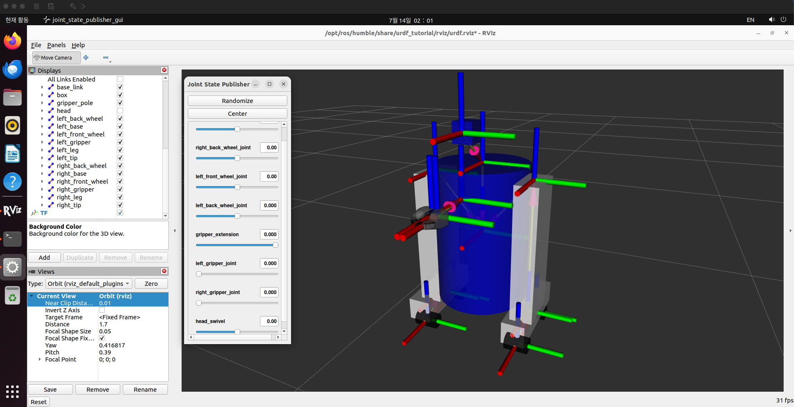
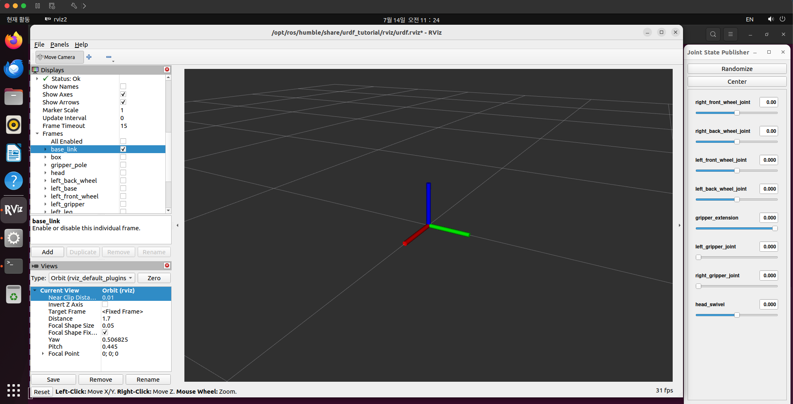
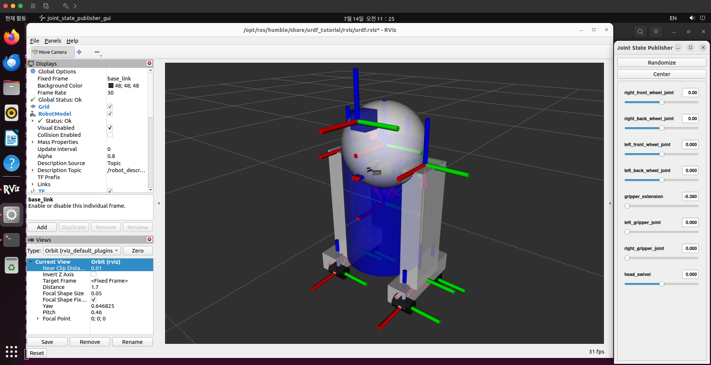

# (문제1) RViz2와 TF(Transform Frames)

> 문제 제목: "로봇의 발이 일을 하면 로봇의 머리는 가만히 있어도 이동하게 된다."
> 이 문장이 컴퓨터에게는 당연하지 않다 — 바퀴가 1m 굴렀을 때 머리도 1m 이동했다는 것을
> 계산해주는 체계가 필요하며, 그것이 이 문제에서 학습한 **TF**다. 그리고 그것을 눈으로
> 확인하는 도구가 **RViz2**다.

## 1. RViz2란 무엇인가

- **RViz2**는 ROS2의 **시각화 도구**다. 로봇의 상태(모델, 좌표계, 센서 데이터)를 3D 화면으로
  "보여주기만" 한다. 물리 법칙을 계산해 로봇을 움직여주는 것은 시뮬레이터인 **Gazebo**의
  역할이고, RViz2는 데이터를 그려주는 모니터(계기판)다.
  - 한 줄 정리: **RViz2는 로봇을 볼 수 있는 도구, Gazebo는 로봇을 움직이는 도구.**
- 라인트레이서 운반 로봇 맥락에서는 "IR 센서가 지금 뭘 보고 있나", "로봇이 자기 위치를
  어디로 알고 있나"를 들여다보는 계기판 역할을 한다.
- **URDF**는 로봇의 몸 구조(어떤 부품이 어디에 어떻게 붙어 있는지)를 적은 명세 파일이다.
  아래 launch 명령이 하는 일이 "이 URDF 파일을 읽어서 RViz2에 그려라"이다.

## 2. 실습 환경 및 튜토리얼 실행

실습 환경: VMware Fusion 상의 Ubuntu 22.04 (arm64) + ROS2 Humble.
RViz2는 GUI 프로그램이므로 SSH 세션이 아닌 **VM 데스크톱 화면의 터미널**에서 실행해야 한다.

### 2.1 패키지 설치

```bash
sudo apt install -y ros-humble-urdf-tutorial
```

설치 전에 launch를 먼저 실행했더니 다음 에러가 났다 (시행착오 기록):

```
Package 'urdf_tutorial' not found: "package 'urdf_tutorial' not found, searching: ['/opt/ros/humble']"
```

- `apt` 패키지 이름은 `ros-humble-urdf-tutorial`, ROS2 내부에서 부르는 이름은 `urdf_tutorial`이다.
  ROS2 패키지를 apt로 배포할 때 `ros-<배포판>-<패키지명의 _를 -로>` 규칙으로 이름이 바뀐다.

### 2.2 튜토리얼 로봇 띄우기

```bash
ros2 launch urdf_tutorial display.launch.py model:=/opt/ros/humble/share/urdf_tutorial/urdf/08-macroed.urdf.xacro
```

- `ros2 launch` — 노드 여러 개를 한 번에 실행한다.
- `model:=...` — launch 파일에 "이 URDF 파일을 그려라"라고 넘기는 인자.

실행하면 프로세스 3개가 뜬다 (실제 출력 발췌):

```
[INFO] [robot_state_publisher-1]: process started with pid [3392]
[INFO] [joint_state_publisher_gui-2]: process started with pid [3394]
[INFO] [rviz2-3]: process started with pid [3396]
[robot_state_publisher-1] [INFO] ... got segment base_link
[robot_state_publisher-1] [INFO] ... got segment box
[robot_state_publisher-1] [INFO] ... got segment head
[robot_state_publisher-1] [INFO] ... got segment left_front_wheel
[robot_state_publisher-1] [INFO] ... got segment left_gripper
(이하 생략 — 로봇의 전체 링크 명단이 출력됨)
```

| 프로세스 | 역할 |
|---|---|
| `robot_state_publisher` | URDF와 조인트 상태를 읽어 TF(변환)를 방송 |
| `joint_state_publisher_gui` | 슬라이더로 조인트 값을 바꾸는 작은 창 |
| `rviz2` | 3D 시각화 화면 |

`got segment ...` 목록이 이 로봇을 구성하는 **부품(링크, link) 명단**이며, 곧 TF 트리의
노드들이다. 중간에 나오는 `KDL ... root link base_link has an inertia` WARN은 알려진
경고로 이 실습에는 영향이 없다.

## 3. 로봇 모델 구조 탐색 (Displays > RobotModel > Links)

- **Displays > RobotModel > Links**를 펼치면 링크 명단이 체크박스로 나온다.
  `head`를 끄면 머리만 사라지고 몸통은 남는다 — 이 로봇은 하나의 통짜 모델이 아니라
  **여러 부품(링크)의 조합**이고, 부품들을 이어붙인 설계도가 URDF 파일이다.
- 옵션 변경 실험: RobotModel의 **Alpha**를 0.8로 내려 로봇을 반투명하게 만들었고,
  **Global Options > Background Color**로 배경색을 바꿔보았다.



## 4. TF(Transform Frames) 조사

TF는 세 가지 개념으로 이루어진다.

### 4.1 좌표계 (Frame)

로봇의 부품마다 자기만의 원점과 방향축을 가진 좌표계가 붙어 있다 (`base_link` 좌표계,
`head` 좌표계, `left_front_wheel` 좌표계 …). 모든 측정값은 **어떤 좌표계 기준인지**가
함께 있어야 의미가 있다. 예: "IR 센서 좌표계 기준으로 3cm 앞에 검은 선이 있다."

### 4.2 변환 (Transform)

두 좌표계 사이의 관계 — **"A에서 B까지 얼마나 떨어져 있고(평행이동), 얼마나 돌아가
있는가(회전)"** 두 가지 정보를 담는다. 이 변환만 알면 좌표를 자동 환산할 수 있다:
센서 좌표계에서 본 "3cm 앞의 선"이 로봇 몸통 기준으로 어디인지 행렬 곱으로 계산된다.

### 4.3 트리 (Tree)

변환들은 **부모–자식의 나무 구조**로 연결된다. 튜토리얼 로봇의 트리:

```
base_link ─┬─ head
           ├─ left_leg ── left_base ─┬─ left_front_wheel
           │                         └─ left_back_wheel
           ├─ right_leg ── ...
           └─ gripper_pole ─┬─ left_gripper ── left_tip
                            └─ right_gripper ── right_tip
```

- 영향은 **부모→자식 방향으로만** 흐른다. `head_swivel` 조인트를 돌리면 자식(head)만
  움직이고 부모(base_link)는 영향받지 않는다. 반대로 base_link가 움직이면(로봇 전진)
  자식인 head는 자동으로 따라간다 — **문제 제목의 답이 이것이다.**
- 트리 구조 덕분에 어떤 두 좌표계 사이의 변환이든 트리를 타고 올라갔다 내려오며 계산할
  수 있다. ROS2에서 이 변환들을 끊임없이 방송·관리하는 시스템 전체가 **TF(tf2)**다.

### 4.4 시뮬레이션 환경에서 TF란

시뮬레이션에서는 실물 로봇 대신 TF 방송이 "로봇이 지금 어디에 어떤 자세로 있는가"의
유일한 진실 노릇을 한다. `robot_state_publisher`가 URDF와 조인트 상태를 읽어 TF를
방송하고, RViz2는 그것을 받아 그린다.

라인트레이서 적용 예: IR 센서가 `base_link`보다 5cm 앞에 붙어 있다면, "센서는 base_link
앞 5cm"라는 변환을 **한 번만** 등록해두면 된다. 로봇이 전진해 base_link가 1m 이동하면
몸이 이동한 만큼 센서도 이동하는데, 그 계산을 내가 코드로 짜는 게 아니라 **TF(tf2)
시스템이 트리를 타고(세계 → base_link → 센서) 자동으로 해준다.** 이것이 ROS2가 TF를
제공하는 이유다.

## 5. RViz2에서 좌표계·변환·트리를 확인하는 방법

| 확인 대상 | RViz2에서 확인하는 방법 |
|---|---|
| 좌표계 | Displays > **TF > Frames** — 프레임(링크별 좌표계) 목록과 축 표시 |
| 변환 | TF 표시의 **노란 연결선**(부모–자식을 잇는 화살표)이 곧 변환 |
| 트리 | TF > Frames > (프레임) 펼침 > **Parent** 항목 — 부모를 따라가면 트리 전체가 그려짐 |

### 5.1 base_link 축 확인

Displays > RobotModel 체크 해제 → TF 체크 → **Frames를 전부 해제하고 base_link만 선택**하면
빨강·초록·파랑 선 세 개가 한 점에서 뻗어나가는 축만 남는다.

- **빨강 = X축(앞), 초록 = Y축(왼쪽), 파랑 = Z축(위)** — 색 순서 RGB가 축 순서 XYZ에 대응한다.



### 5.2 Joint State Publisher로 조인트 상태 변화

Joint State Publisher 창의 슬라이더를 움직이면 해당 조인트에 연결된 부품과 그 부품의
TF 축이 **함께** 움직인다. 실습에서는 `gripper_extension`을 -0.38로 움직여 집게가
이동하는 것을 확인했다.

동작 흐름: 슬라이더가 조인트 상태를 바꾸면 → `robot_state_publisher`가 새 변환을 방송하고
→ RViz2가 갱신된 TF를 그린다.



## 6. 정리

- RViz2는 **시각화 도구**(보는 것), Gazebo는 **시뮬레이터**(움직이는 것)다.
- TF의 세 개념: **좌표계**(부품마다 붙은 기준), **변환**(떨어진 정도 + 돌아간 정도),
  **트리**(부모–자식 구조, 영향은 부모→자식으로만).
- 부모가 움직이면 자식은 자동으로 따라간다 — "발이 일을 하면 머리는 가만히 있어도
  이동한다"의 소프트웨어적 구현이 TF다.

---

*가정 명시: 실습 스크린샷의 RViz2 옵션 값(Alpha 0.8, 배경색 등)은 탐색 과정에서 임의로
변경한 값이며 지시서가 특정한 값이 아니다.*
