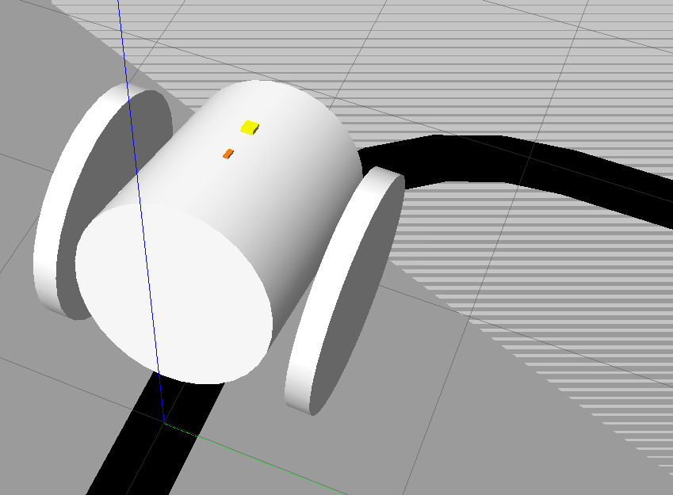

# 실제 로봇으로 — URDF 완성과 ROS2 추상화 (문제10)

---

## 1. 목표

로봇 모델에 아두이노 계열 마이크로보드와 모터 드라이버에 해당하는 링크를 추가해 URDF를 완성한다. ROS2의 추상화 수준을 조사하고, 왜 마이크로보드·모터 드라이버를 저수준으로 직접 제어할 필요가 없는지, 시뮬레이션용 제어 프로그램을 실제 로봇에 그대로 쓰는 방법(Sim-to-Real)을 정리한다. Chapter3의 마지막 문제로, 과정1에서 조사한 마이크로컨트롤러(ex8)·모터 드라이버(ex2)가 로봇 모델과 소프트웨어 구조 안에서 어디에 위치하는지를 확인한다.

---

## 2. 마이크로보드·모터 드라이버 링크 추가

제어 보드(OpenCR 등 아두이노 계열)와 모터 드라이버는 로봇 몸체에 실제로 부착되는 부품이다. 그러나 이들은 **움직이는 관절이 아니므로**, URDF에는 외형·위치·연결 구조만 `fixed` 조인트(또는 상위 링크의 visual 요소)로 반영하면 된다.

지시서가 요구하는 두 부품을 완성 URDF(`tracked_robot.urdf`)에 다음과 같이 반영했다.

| 부품 | URDF 반영 위치 | 형태 |
| --- | --- | --- |
| 아두이노 마이크로보드 (OpenCR) | 1층 받침대 `plate1_link` 위 | 초록색 박스 (10.2 × 7.4cm), fixed 연결 |
| 모터 드라이버 | `base_link`의 모터 위치 | 다이나믹셀 XC430 2개의 검은 박스, fixed 연결 |

*가정 명시: 이 로봇의 구동계는 다이나믹셀 XC430 스마트 모터로, 모터 드라이버 회로가 모터 케이스 안에 내장되어 있고 OpenCR 보드가 TTL 통신으로 이를 제어한다. 따라서 별도의 독립 드라이버 보드 링크 대신, 드라이버를 내장한 모터 유닛 2개를 "모터 드라이버에 해당하는 링크"로 반영했다. 지시서의 요구대로 외형·위치·연결 구조만 모델링했고, 움직이는 관절이 아니므로 모두 fixed로 두었다.*

```xml
<visual><!-- OpenCR 10.2 x 7.4cm, 1층 받침대 윗면 +3.5cm -->
  <origin xyz="0.0215 0 0.0382"/>
  <geometry><box size="0.102 0.074 0.008"/></geometry>
  <material name="board_green"/>
</visual>
```

**URDF의 모든 링크마다 대응하는 ROS 노드를 만들 필요는 없다.** 움직임·통신이 있는 부분(바퀴, 센서)만 노드·플러그인으로 다루고, 단순 구조물(받침대, 기둥, 보드)은 시각·물리 정보만 두면 된다.



---

## 3. ROS2의 추상화 수준

ROS2는 하드웨어의 세부 동작을 여러 계층으로 감싸, 상위 계층이 하위 세부를 몰라도 되게 한다.

| 계층 | 하는 일 | 예 |
| --- | --- | --- |
| 응용 (제어 로직) | "어디로 얼마나 갈지" 결정 | 라인트레이싱 PID 노드 → `/cmd_vel` |
| 메시지·토픽 | 표준 인터페이스로 노드 간 통신 | `geometry_msgs/Twist`, `sensor_msgs/JointState` |
| 드라이버·플러그인 | 명령을 실제 모터 신호로 변환 | diff_drive 플러그인, 하드웨어 인터페이스 |
| 하드웨어 | 실제 모터·엔코더 구동 | 모터 드라이버, 아두이노(OpenCR) 펌웨어 |

---

## 4. 왜 저수준 제어를 직접 할 필요가 없는가

우리 제어 노드는 `/cmd_vel`에 "선속도·각속도"만 발행한다. 이 명령을 각 모터의 RPM으로 나누고, PWM 듀티비를 계산하고, 핀에 신호를 내보내는 일(ex8에서 조사한 그 저수준 작업들)은 모두 아래 계층 — 하드웨어 인터페이스와 모터 드라이버 펌웨어 — 이 담당한다.

- **표준 메시지와 하드웨어 추상화 계층**이 세부 신호 처리를 대신하므로, 응용 개발자는 아두이노의 핀·타이머·PWM을 건드리지 않고 "무엇을 할지"에만 집중할 수 있다.
- **부품 교체에 강하다:** 모터나 드라이버가 바뀌어도 그 부분의 드라이버 계층만 교체하면 상위 제어 로직은 수정 없이 재사용된다.
- 이것이 ROS2를 쓰는 핵심 이유 중 하나다 — 과정1에서 모터 드라이버의 레지스터와 PWM을 조사했지만, ROS2 위에서는 그 지식이 "드라이버 계층 안에서 일어나는 일"로 캡슐화된다.

---

## 5. 시뮬레이션 → 실제 로봇 (Sim-to-Real)

Gazebo에서 쓰던 제어 프로그램(문제7~9의 라인트레이싱·PID 노드)을 실제 로봇에 거의 그대로 쓸 수 있는 이유는, **양쪽이 같은 토픽 인터페이스를 쓰기 때문**이다.

```
[시뮬레이션]  제어 노드 → /cmd_vel → Gazebo diff_drive 플러그인 → 가상 바퀴
[실제 로봇]   제어 노드 → /cmd_vel → 하드웨어 인터페이스(보드 통신) → 실제 모터
```

- `/cmd_vel`을 **구독하는 쪽**만 Gazebo 플러그인에서 실제 하드웨어 드라이버로 바꾸면, 제어 로직(라인트레이싱·PID)은 수정 없이 동작한다.
- 센서도 마찬가지다 — `/scan`, `/joint_states` 같은 표준 토픽을 발행하는 주체가 가상 센서 플러그인에서 실물 센서 드라이버로 바뀔 뿐, 구독하는 제어 노드는 차이를 모른다.

즉 Chapter3 전체에서 만든 시뮬레이션 스택은 버려지는 연습이 아니라, 실물 라인트레이서 운반 로봇에 이식될 제어 소프트웨어 그 자체다.

---

## 6. 완성된 URDF — `tracked_robot.urdf`

실물 프로토타입을 실측해 반영한 트랙형 이동 로봇의 완성 URDF다. 주요 구성:

- **구조:** 받침대 3층 구조. 1층에 OpenCR 보드, 2층에 USB 허브·Jetson AGX Xavier·보조 배터리, 천장에 LiDAR 받침대
- **센서:** RPLIDAR A1M8(천장 위), Intel RealSense D435 뎁스 카메라(전방 0.314rad 하향), IMU(OpenCR 보드 정중앙, x=전방/y=좌/z=상 표준 축)
- **구동:** 트랙(캐터필러)은 시각 전용으로 두고, 물리 구동은 트랙 중심선의 **숨김 구동륜 2개(차동 구동, `wheel_separation` 0.16m)** + 캐스터 구 4개(마찰 0.1)로 근사
- **Gazebo 플러그인:** diff_drive, joint_state_publisher, IMU(100Hz), LiDAR(360샘플, 10Hz, 가우시안 노이즈), 뎁스 카메라(15Hz)까지 포함해 시뮬레이션과 실물이 같은 토픽 구성을 갖도록 했다

전체 파일은 첨부한 `tracked_robot.urdf` 참조 (링크 30여 개, 약 600줄).

---

## 첨부

- `tracked_robot.urdf` — 완성된 트랙형 로봇 URDF (보드·센서·플러그인 포함)
- `sw_ws.tar.gz` — 워크스페이스 소스 압축본
- `robot_with_board.png` — 완성 로봇 모델 확인 화면
