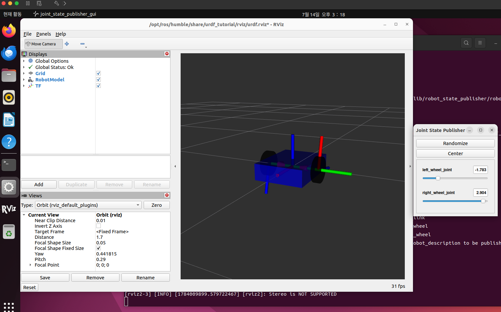

# (문제2) 가상 로봇 만들기 — URDF와 xacro

박스형 몸통에 바퀴 두 개를 가진 로봇을 URDF로 직접 작성하고, RViz2로 바퀴가 정상적인
방향으로 회전하는지 검증한 뒤, 같은 로봇을 xacro 형식으로도 만들었다.

실습 환경: VMware Fusion 상의 Ubuntu 22.04 + ROS2 Humble, 작업 디렉토리 `~/urdf_ws`
(워크스페이스 압축본 `urdf_ws.tar.gz`와 모델 파일 2종을 이 문서와 함께 게시).

## 1. URDF란 무엇인가

**URDF(Unified Robot Description Format)** 는 로봇의 몸 구조를 기술하는 XML 형식의
텍스트 파일이다. 문제1에서 확인한 두 가지 — 로봇은 "여러 부품(링크)의 조합"이고
부품들은 "부모–자식 트리"로 연결된다 — 를 그대로 적는 파일이며, `robot_state_publisher`가
이 파일을 읽어 TF를 방송한다.

### 1.1 링크 (link)

로봇을 구성하는 **강체 부품 하나** (몸통, 바퀴 등). 주요 하위 요소:

| 요소 | 내용 | 이번 실습 |
|---|---|---|
| `visual` | 생김새 — `geometry`(box/cylinder/sphere), `material`(색), `origin`(모양의 위치·회전) | 사용 |
| `collision` | 충돌 계산용 형상 | 생략 |
| `inertial` | 질량·관성 (물리 시뮬레이션용) | 생략 |

### 1.2 조인트 (joint)

부품을 **부모 링크에 연결하는 관절**. 반드시 `parent`와 `child`를 지정하며, 이 연결이
TF 트리를 만든다. 주요 type:

| type | 움직임 | 예 |
|---|---|---|
| `fixed` | 고정 | 몸통에 붙은 센서 |
| `revolute` | 제한된 각도 내 회전 | 로봇 팔 관절 |
| `continuous` | **무한 회전** | **바퀴** (이번 실습) |
| `prismatic` | 직선 이동 | 문제1의 gripper_extension |

조인트의 주요 하위 요소: `<origin xyz rpy>`(부모의 어디에 붙는지 + 좌표계 회전),
`<axis xyz>`(회전축 방향).

## 2. URDF 로봇 제작 과정

한 번에 다 만들지 않고 몸통 → 왼쪽 바퀴 → 오른쪽 바퀴 순으로 조각내어 확인하며
진행했다. 각 단계마다 다음 명령으로 RViz2에서 확인했다:

```bash
ros2 launch urdf_tutorial display.launch.py model:=/home/kangmose/urdf_ws/my_robot.urdf
```

로봇 구성: 링크 3개(몸통 + 바퀴 2개), 조인트 2개(바퀴마다 1개).

- 몸통 `base_link`: `<box size="0.4 0.3 0.1"/>` (앞뒤 0.4m × 좌우 0.3m × 높이 0.1m), 파랑
- 바퀴 `left_wheel`/`right_wheel`: `<cylinder radius="0.08" length="0.04"/>`, 검정
- 바퀴 조인트: `type="continuous"` (바퀴는 각도 제한 없이 무한히 굴러야 하므로.
  `revolute`는 멈춤 각이 있는 로봇 팔용), `<axis xyz="0 1 0"/>` (로봇이 앞(X)으로
  구르려면 좌우 방향 축(Y) 중심으로 회전해야 함)
- 바퀴 위치: 몸통 좌우 폭 0.3m의 절반(0.15) + 바퀴 두께 절반(0.02) = `y = ±0.17`

완성된 모델 파일은 함께 게시한 `my_robot.urdf` 참조.

### 2.1 시행착오 ① — 바퀴가 누워서 생성됨

바퀴 link와 joint를 추가하고 실행하니 바퀴가 서 있지 않고 **바닥에 퍽(puck)처럼 누워**
있었다. 원인: URDF의 `<cylinder>`는 **길이 방향이 항상 자기 Z축(위아래)** 이라는 규칙이
있어, 아무 조치 없이 만들면 세워둔 캔 모양이 된다. 바퀴가 되려면 평평한 면이 위가 아니라
옆(Y)을 보도록 90° 굴려야 한다.

- 회전은 `<origin>`의 `rpy`(roll·pitch·yaw)로 준다. 단위는 라디안, 90° = π/2 ≈ 1.5708
- roll(X축 중심)에 넣어야 하는 이유: 원기둥의 축이 Z를 향해 있는데, **회전축과 나란한
  방향은 회전해도 변하지 않는다**. yaw(Z축 중심)는 제자리 회전이라 변화가 없고,
  pitch(Y축 중심)는 눕히긴 하지만 축이 X(앞뒤)로 넘어가 게걸음용 바퀴가 된다.
  Z를 Y로 보내려면 둘 다에 수직인 X축으로 굴려야 한다 → `rpy="1.5708 0 0"`

### 2.2 시행착오 ② — rpy에 자리표시 글자를 그대로 입력 (파싱 에러)

`rpy="R P Y"` 형식 설명의 자리표시 글자를 실제 파일에 넣었더니 파싱 에러가 났다:

```
Error: Unable to parse component [P] to a double (while parsing a vector value)
Error: Malformed parent origin element for joint [left_wheel_joint]
```

URDF 파서 에러는 위에서부터 읽으면 문제의 조인트와 요소를 정확히 지목해준다.
rpy의 세 자리는 모두 숫자여야 한다.

### 2.3 시행착오 ③ — 바퀴가 팽이처럼 옆으로 회전 (이번 문제의 핵심 학습)

joint의 `<origin>`에 `rpy="1.5708 0 0"`을 넣자 바퀴는 제대로 섰지만, Joint State
Publisher 슬라이더를 움직이니 **바퀴가 앞으로 구르지 않고 레코드판처럼 수평으로**
돌았다. RViz2의 TF 표시를 보니 바퀴의 초록(Y) 축이 왼쪽이 아니라 하늘을 향해 있었다.

원인: **`<axis>`의 좌표는 조인트 자신의 좌표계 기준으로 해석된다.** joint의 origin에
rpy를 주면 조인트 좌표계가 통째로 90° 돌아가서, 회전축 `0 1 0`(조인트의 Y)이 세상
기준으로는 "왼쪽"이 아니라 "위"가 된다 — 그래서 팽이처럼 돌았다.

해결: rpy를 joint의 origin에서 빼고 **link의 `<visual>` 안 origin으로** 옮겼다.
조인트 좌표계는 몸통과 나란히 유지되어 axis가 진짜 Y(왼쪽)를 가리키고, 원기둥
**그림만** 90° 눕는다.

> **"조인트 좌표계는 바르게 두고, 그림만 눕힌다"** — URDF에서 바퀴를 만들 때의 표준 수법.

수정 후 슬라이더 검증: 바퀴가 자전거 바퀴처럼 앞→아래→뒤→위로 정상적으로 굴렀다.

### 2.4 시행착오 ④ — 복사–붙여넣기 후 child 미수정 (Two root links)

오른쪽 바퀴를 왼쪽에서 복사해 만들며 joint의 `child`를 `left_wheel`에서 안 바꿨더니:

```
Error: Failed to find root link: Two root links found: [base_link] and [right_wheel]
```

root link = 부모가 없는 트리 꼭대기 링크. 트리의 뿌리는 하나여야 하는데,
`right_wheel`을 자식으로 삼는 조인트가 없어서 뿌리가 둘이 됐다는 뜻이다.
child를 `right_wheel`로 고쳐 해결했다.

- 왼쪽 → 오른쪽 바퀴에서 바뀐 것: **이름과 위치(y 부호, +0.17 → −0.17)뿐**.
  rpy·axis·geometry는 동일하다. (원기둥은 회전 대칭이라 rpy를 +90°로 굴리든 −90°로
  굴리든 같은 모양이고, 회전축도 양쪽 다 같은 Y축이기 때문)

### 2.5 완성 및 검증

바퀴 두 개가 몸통 양쪽에 붙고, 슬라이더 두 개(left_wheel_joint, right_wheel_joint)로
각각 돌려 **양쪽 모두 앞으로 구르는 방향으로 회전**함을 확인했다 (지시서 검증 항목).



## 3. xacro란 무엇인가

**xacro(XML macro)** 는 URDF를 위한 매크로 언어다. 순수 URDF의 문제 — 거의 같은 코드를
복사하다가 생기는 실수(위 2.4의 child 미수정이 정확히 그 사례) — 를 없애준다.
launch에 넘기면 자동으로 순수 URDF로 변환된 뒤 로딩된다 (문제1의
`08-macroed.urdf.xacro`가 xacro 파일이었다).

주요 기능(구조):

| 기능 | 문법 | 용도 |
|---|---|---|
| 변수 | `<xacro:property name="wheel_radius" value="0.08"/>` → `${wheel_radius}` | 값을 한 곳에서만 관리 |
| 매크로 | `<xacro:macro name="wheel" params="prefix y"> ... </xacro:macro>` | 링크+조인트 묶음을 함수처럼 정의 |
| 매크로 호출 | `<xacro:wheel prefix="left" y="${wheel_y}"/>` | 인자만 바꿔 재사용 |
| 수식 | `${-wheel_y}`, `${0.3/2 + 0.02}` | 치수 관계를 식으로 표현 |

- 파일 첫 줄의 `<robot ... xmlns:xacro="http://www.ros.org/wiki/xacro">` 선언이 필수다.
- 매크로 안에서 `${prefix}_wheel`로 이름을 만들면 호출 시 `left_wheel`/`right_wheel`로
  치환되므로, **child를 안 바꾸는 실수가 원천적으로 불가능**해진다.

같은 로봇을 xacro로 변환한 결과는 함께 게시한 `my_robot.urdf.xacro` 참조. 바퀴 두 개가
매크로 호출 두 줄로 끝난다.

### 3.1 xacro 실행 및 검증

```bash
ros2 launch urdf_tutorial display.launch.py model:=/home/kangmose/urdf_ws/my_robot.urdf.xacro
```

URDF 버전과 완전히 같은 로봇이 뜨고 슬라이더 검증도 동일하게 통과했다.

시행착오 ⑤: 파일명을 `my_robot_urdf.xacro`로 잘못 저장해(`.` 대신 `_`)
`FileNotFoundError`가 났다. `ls`로 실제 파일명을 확인하고 `mv`로 바로잡았다.
nano는 없는 이름도 조용히 새 파일로 열어주므로, 경로 입력 시 Tab 자동완성을 쓰면
이런 오타를 차단할 수 있다.

## 4. 정리

- **링크**는 로봇을 구성하는 부품 하나, **조인트**는 부품을 부모 링크에 연결하는 관절.
  조인트의 parent–child 연결이 TF 트리를 만들며, 뿌리(root link)는 하나여야 한다.
- 바퀴 조인트는 `continuous`(무한 회전), 회전축은 좌우 방향 `axis xyz="0 1 0"`.
- **axis는 조인트 자신의 좌표계 기준**이므로, 원기둥을 눕히는 rpy는 joint가 아니라
  link의 visual origin에 준다 — "조인트 좌표계는 바르게, 그림만 눕힌다".
- **xacro**는 변수·매크로·수식으로 URDF의 반복을 제거해, 편하고 복사 실수(오타율)를
  줄인다.

---

*가정 명시: 로봇의 구체 치수(몸통 0.4×0.3×0.1m, 바퀴 반지름 0.08m·두께 0.04m)와 색은
지시서에 지정이 없어 자유롭게 정했다. collision·inertial은 RViz2 시각 확인 목적상
생략했다. 지시서의 "워크 스페이스 디렉토리"는 이번 문제의 작업 디렉토리 `~/urdf_ws`로
해석해 통째로 압축했다.*
