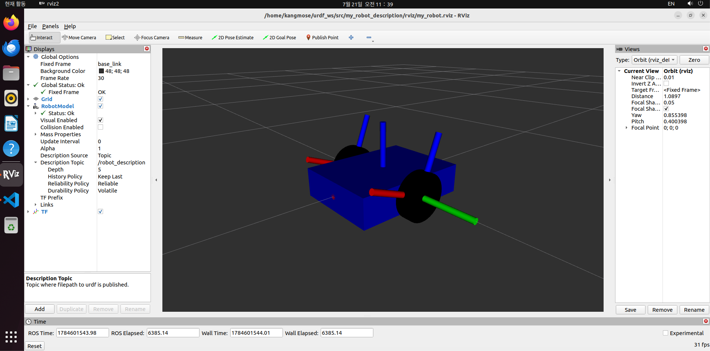
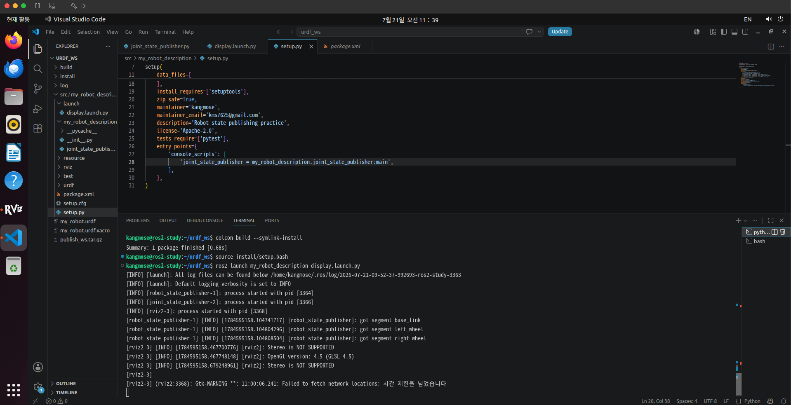

# 로봇 상태 게시와 조인트 상태 퍼블리셔 구현 (문제3)

---

## 1. 배경

이전 문제(3/2)에서 URDF로 차동 구동 로봇 모델(base_link + 좌우 바퀴)을 정의했다. 그러나 URDF는 로봇의 **구조**(어떤 링크가 어떤 조인트로 연결되는지)만 기술할 뿐, 바퀴가 현재 몇 라디안 회전해 있는지 같은 **상태**는 담고 있지 않다. 이번 문제에서는 로봇의 상태를 게시한다는 것의 의미를 조사하고, 조인트 상태를 게시하는 노드를 직접 구현해 RViz2에서 움직이는 로봇 모델을 확인한다.

---

## 2. ROS2에서 "로봇의 상태를 게시한다"의 의미

로봇의 상태 게시란, 시시각각 변하는 로봇의 관절 값(각도·속도 등)을 토픽으로 발행하고, 이를 바탕으로 각 링크의 3차원 위치·자세를 **TF(좌표 변환) 트리**로 변환해 시스템 전체에 알리는 것을 말한다.

- 조인트 상태는 `sensor_msgs/JointState` 타입으로 `/joint_states` 토픽에 발행된다.
- 이를 받아 계산된 링크 간 좌표 변환은 `/tf` 토픽으로 방송된다.
- RViz2, 내비게이션, 센서 융합 등 모든 도구는 이 TF를 구독해 "지금 이 순간 특정 링크가 공간상 어디에 어떤 자세로 있는지"를 알게 된다.

라인트레이싱 운반 로봇의 관점에서 보면, 엔코더(과정1 ex5)가 읽은 바퀴 회전각을 `/joint_states`로 게시해야 로봇이 자기 바퀴의 상태를 알 수 있고, 나아가 바퀴 회전량으로부터 주행 거리를 추정하는 오도메트리가 가능해진다. 이번 실습의 조인트 상태 퍼블리셔는 실제 로봇에서 엔코더가 맡게 될 역할을 시뮬레이션하는 것이다.

---

## 3. robot_state_publisher 노드와 /joint_states 메시지의 관계

### 3.1 전체 구조

```
┌────────────────────────┐    /joint_states     ┌────────────────────────┐
│ joint_state_publisher  │ ──────────────────→  │ robot_state_publisher  │
│ (직접 구현한 노드)        │   JointState 메시지   │ (ROS2 제공, URDF 보유)   │
└────────────────────────┘                      └───────────┬────────────┘
                                                            │ /tf
                                                            ↓
                                                          RViz2
```

### 3.2 역할 분담

| 노드 | 역할 | 알고 있는 것 |
|------|------|--------------|
| joint_state_publisher (직접 구현) | 각 조인트의 현재 값(예: left_wheel_joint = 1.2 rad)을 `/joint_states` 토픽에 주기적으로 발행 | 조인트 이름과 현재 각도 |
| robot_state_publisher (ROS2 제공) | URDF의 기구학 정보와 수신한 조인트 값으로 순기구학을 계산해, 링크별 좌표 변환을 `/tf`로 발행 | URDF 전체 구조 (`robot_description` 파라미터로 수신) |

robot_state_publisher는 URDF를 `robot_description` 파라미터로 받아 들고 있다가, `/joint_states`를 구독해 값이 들어올 때마다 "left_wheel은 base_link 기준 (0, 0.17, 0) 위치에서 y축으로 1.2 rad 회전한 자세"와 같은 변환을 계산해 TF로 내보낸다.

### 3.3 핵심 동작 원리: 고정 조인트와 가동 조인트의 차이

- **fixed 조인트**: 상태가 변하지 않으므로 robot_state_publisher가 `/joint_states` 없이도 TF(`/tf_static`)를 발행한다.
- **continuous / revolute 등 가동 조인트**: `/joint_states` 메시지가 들어오지 않으면 **TF가 발행되지 않는다.** 이 경우 RViz2에서 해당 링크가 표시되지 않고 "No transform" 오류가 발생한다.

우리 로봇의 두 바퀴는 continuous 조인트이므로, 조인트 상태를 발행하는 노드가 반드시 필요하다. 이것이 이번 문제에서 joint_state_publisher 노드를 직접 구현하는 이유다.

---

## 4. 패키지 구성

3/2까지는 URDF 파일만 단독으로 존재했으므로, 이번 문제에서 처음으로 colcon 워크스페이스와 ROS2 파이썬 패키지를 구성했다.

```bash
cd ~/urdf_ws/src
ros2 pkg create my_robot_description --build-type ament_python --dependencies rclpy sensor_msgs
```

최종 패키지 구조:

```
~/urdf_ws/
└── src/
    └── my_robot_description/
        ├── package.xml
        ├── setup.py
        ├── my_robot_description/
        │   ├── __init__.py
        │   └── joint_state_publisher.py   ← 조인트 상태 퍼블리셔 (직접 작성)
        ├── urdf/
        │   ├── my_robot.urdf              ← 3/2에서 작성한 모델
        │   └── my_robot.urdf.xacro
        ├── launch/
        │   └── display.launch.py          ← 런치 파일 (직접 작성)
        └── rviz/
            └── my_robot.rviz              ← RViz에서 저장한 설정 파일
```

---

## 5. joint_state_publisher.py 구현

```python
import math
import rclpy
from rclpy.node import Node
from sensor_msgs.msg import JointState


class MyJointStatePublisher(Node):
    def __init__(self):
        super().__init__('my_joint_state_publisher')
        self.publisher = self.create_publisher(JointState, 'joint_states', 10)
        self.timer = self.create_timer(0.05, self.publish_joint_states)  # 20Hz
        self.angle = 0.0

    def publish_joint_states(self):
        msg = JointState()
        msg.header.stamp = self.get_clock().now().to_msg()
        msg.name = ['left_wheel_joint', 'right_wheel_joint']
        msg.position = [self.angle, self.angle]
        self.angle += 0.1
        if self.angle > 2 * math.pi:
            self.angle -= 2 * math.pi
        self.publisher.publish(msg)


def main():
    rclpy.init()
    node = MyJointStatePublisher()
    rclpy.spin(node)
    node.destroy_node()
    rclpy.shutdown()


if __name__ == '__main__':
    main()
```

구현 시 주의한 점:

| 항목 | 내용 |
|------|------|
| `header.stamp` | 반드시 현재 시각으로 채워야 한다. 비어 있으면 robot_state_publisher가 메시지를 무시해, 발행은 되는데 RViz에 반영되지 않는 문제가 생긴다. |
| `msg.name` | URDF의 **조인트 이름**(`left_wheel_joint`, `right_wheel_joint`)과 철자까지 정확히 일치해야 한다 (링크 이름이 아님). |
| `name` / `position` | 같은 길이의 배열로, 인덱스로 짝을 이룬다. |
| 각도 증가 | 타이머(20Hz)마다 0.1 rad씩 증가시켜 바퀴가 계속 굴러가는 상황을 시뮬레이션했다. 실제 로봇이라면 이 자리에 엔코더 측정값이 들어간다. |

---

## 6. Launch File 작성

노드 3개(직접 만든 퍼블리셔, robot_state_publisher, RViz2)를 한 번에 실행하기 위해 `launch/display.launch.py`를 작성했다.

```python
import os
from ament_index_python.packages import get_package_share_directory
from launch import LaunchDescription
from launch_ros.actions import Node


def generate_launch_description():
    pkg_share = get_package_share_directory('my_robot_description')
    urdf_path = os.path.join(pkg_share, 'urdf', 'my_robot.urdf')
    rviz_config_path = os.path.join(pkg_share, 'rviz', 'my_robot.rviz')

    with open(urdf_path, 'r') as f:
        robot_description = f.read()

    return LaunchDescription([
        Node(
            package='robot_state_publisher',
            executable='robot_state_publisher',
            parameters=[{'robot_description': robot_description}],
        ),
        Node(
            package='my_robot_description',
            executable='joint_state_publisher',
        ),
        Node(
            package='rviz2',
            executable='rviz2',
            arguments=['-d', rviz_config_path],
        ),
    ])
```

- URDF 파일을 **문자열로 읽어** `robot_description` 파라미터로 robot_state_publisher에 전달한다 (파일 경로가 아니라 내용을 넘기는 것이 핵심).
- RViz2 실행 시 `-d` 옵션으로 저장해 둔 설정 파일을 지정해, 실행 즉시 Fixed Frame(`base_link`)과 RobotModel·TF 디스플레이가 적용된 화면이 뜨도록 했다.

### setup.py / package.xml 수정 사항

`setup.py`에는 두 가지를 추가했다.

```python
data_files=[
    ...
    (os.path.join('share', package_name, 'urdf'), glob('urdf/*')),
    (os.path.join('share', package_name, 'launch'), glob('launch/*.py')),
    (os.path.join('share', package_name, 'rviz'), glob('rviz/*.rviz')),
],
entry_points={
    'console_scripts': [
        'joint_state_publisher = my_robot_description.joint_state_publisher:main',
    ],
},
```

- `data_files`: 빌드 시 urdf/launch/rviz 파일을 share 디렉토리로 복사해, 런치 파일이 `get_package_share_directory()`로 찾을 수 있게 한다.
- `entry_points`: `ros2 run`과 런치 파일에서 실행할 수 있는 실행 파일(`joint_state_publisher`)을 등록한다.

`package.xml`에는 실행 의존성을 추가했다.

```xml
<exec_depend>robot_state_publisher</exec_depend>
<exec_depend>rviz2</exec_depend>
```

---

## 7. 빌드 및 실행 결과

```bash
cd ~/urdf_ws
colcon build --symlink-install
source install/setup.bash
ros2 launch my_robot_description display.launch.py
```

실행 로그에서 robot_state_publisher가 URDF를 받아 세 링크의 TF 세그먼트를 생성한 것을 확인할 수 있었다.

```
[robot_state_publisher-1] [INFO] [robot_state_publisher]: got segment base_link
[robot_state_publisher-1] [INFO] [robot_state_publisher]: got segment left_wheel
[robot_state_publisher-1] [INFO] [robot_state_publisher]: got segment right_wheel
```

RViz2에서 파란 몸체와 검은 바퀴 두 개로 이루어진 로봇 모델이 표시되었다. 바퀴는 매끈한 원기둥이라 회전이 눈에 보이지 않으므로, TF 디스플레이를 추가해 바퀴 링크의 좌표축이 회전하는 것으로 조인트 상태가 실시간 반영됨을 확인했다. 별도 터미널에서 `ros2 topic echo /joint_states`로 position 값이 0.1씩 증가하다가 2π에서 0으로 되돌아가는 것도 확인했다.





확인 후 RViz의 File → Save Config As로 설정을 `rviz/my_robot.rviz`에 저장하고 다시 빌드해, 이후에는 런치 한 번으로 완성된 화면이 바로 뜨도록 했다.

---

## 8. 시행착오 및 해결

| 문제 | 원인 | 해결 |
|------|------|------|
| `colcon build` 시 `SyntaxError: unterminated string literal` | setup.py의 entry_points 문자열이 붙여넣기 과정에서 두 줄로 쪼개짐 | 해당 문자열을 한 줄로 수정 |
| `Package 'my_robot_description' not found` | 위 빌드 실패로 패키지가 설치되지 않은 상태에서 launch 시도 | 빌드 성공 후 자동 해결 |
| 바퀴가 회전하는지 육안으로 확인 불가 | 원기둥은 자기 축 회전 시 외형 변화가 없음 | TF 디스플레이 추가로 좌표축 회전 확인 + `/joint_states` 토픽 echo로 수치 확인 |

---

## 9. 정리

- URDF는 로봇의 **뼈대**, `/joint_states`는 **관절 각도**, robot_state_publisher는 그 둘을 합쳐 **TF를 만들어내는 계산기**다.
- 가동 조인트는 `/joint_states`가 공급되지 않으면 TF가 발행되지 않으므로, 조인트 상태 퍼블리셔가 반드시 필요하다.
- 이번에 직접 구현한 퍼블리셔는 실제 라인트레이싱 운반 로봇에서 엔코더가 담당할 역할이며, 이후 오도메트리와 주행 제어의 기반이 된다.

## 첨부

- `publish_ws.tar.gz` — 워크스페이스 소스 압축본 (`src/` 디렉토리)
- `rviz_robot_model.png` — RViz2에서 확인한 로봇 모델 및 TF
- `launch_log.png` — 런치 파일 실행 로그
