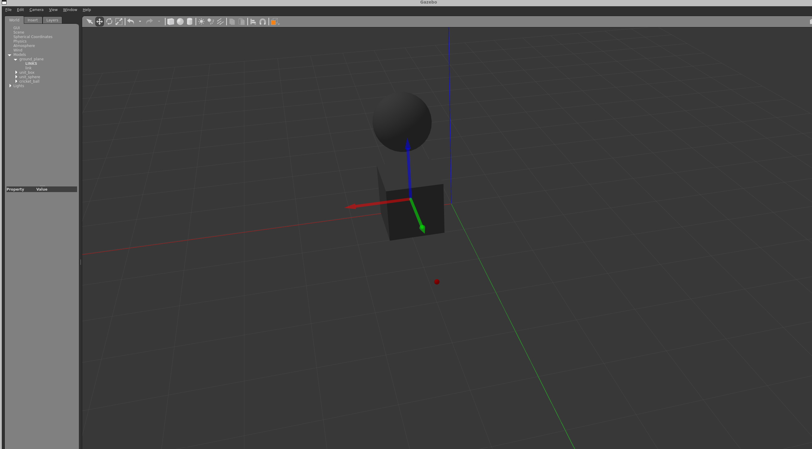

# Gazebo 시뮬레이터 (문제4)

---

## 1. Gazebo와 RViz2의 개념 및 차이점

지금까지 로봇 모델을 확인하는 데 사용한 RViz2와, 이번 문제부터 사용하는 Gazebo는 겉보기에 둘 다 "3D 화면에 로봇이 나오는 프로그램"이지만 역할이 근본적으로 다르다.

### 1.1 Gazebo — 물리 시뮬레이터

Gazebo는 중력·마찰·관성·충돌 같은 실제 물리 법칙이 적용된 가상의 3차원 세계를 제공하는 **물리 시뮬레이터**다. 로봇이 가상 공간에서 물체에 부딪히고, 바퀴가 미끄러지고, 가상 센서(카메라·LiDAR·IR)가 가상 환경을 측정한다. 즉 **실제 로봇을 만들기 전에 하드웨어와 주변 환경 자체를 모사**하는 도구다.

### 1.2 RViz2 — 데이터 시각화 도구

정확히 말하면 RViz2는 시뮬레이터가 아니라 **3D 데이터 시각화 도구(Visualizer)** 다. 로봇이 실제로든 가상으로든 동작 중일 때, 센서 데이터(Point Cloud 등), 좌표 변환 트리(`/tf`), 이동 경로(Path) 같은 **로봇 내부의 소프트웨어 데이터를 사람이 보기 쉽게 그려주는 역할**만 한다. RViz2 자체는 아무것도 계산하거나 움직이게 하지 않는다.

### 1.3 비교 정리

| 항목 | Gazebo | RViz2 |
| --- | --- | --- |
| 주요 목적 | 물리 법칙이 적용된 가상 세계에서 로봇 구동 시뮬레이션 | 로봇 내부의 센서 데이터·상태 정보 시각화 |
| 물리 엔진 | 있음 (중력, 충돌, 마찰, 반발력 연산) | 없음 (데이터가 지시하는 위치에 그대로 렌더링) |
| 주요 입력 | 제어 명령 토픽 (`/cmd_vel` 등) | 센서·상태 데이터 토픽 (`/scan`, `/tf`, `/odom` 등) |
| 가상 센서 | 가상 환경을 감지해 센서 값을 **생성** | 생성된 센서 값을 화면에 **표시** |

라인트레이싱 운반 로봇 관점에서 보면, Gazebo는 "라인이 그려진 바닥과 그 위를 달리는 로봇"을 대신해 주는 도구이고, RViz2는 "그 로봇이 지금 무엇을 보고 어떻게 판단하는지"를 들여다보는 도구다. 실제 트랙과 실물 로봇 없이 제어 알고리즘을 개발·검증하려면 Gazebo가 필요하다.

---

## 2. Gazebo 설치 및 실행

### 2.1 설치

ROS2 Humble에 대응하는 Gazebo(Gazebo Classic 11)와 ROS 연동 패키지를 설치한다. 와일드카드(`*`)로 관련 패키지를 한 번에 설치한다.

```bash
sudo apt update
sudo apt install ros-humble-gazebo* -y
```

### 2.2 실행

```bash
gazebo
```

최초 실행 시에는 Gazebo 공식 모델 라이브러리를 내려받느라 수십 초 이상 걸릴 수 있다.

---

## 3. 기본 물리 특성 실습

### 3.1 박스 배치와 축 색상 비교

1. 상단 툴바의 **Box** 아이콘을 선택해 격자판 위에 정육면체를 배치한다.
2. 이동 도구(화살표 십자 모양)를 선택하고 박스를 클릭하면 3차원 축 기즈모가 나타난다.

**RViz2의 TF 축과 Gazebo의 축 색상은 완전히 일치한다.** 둘 다 ROS 표준 좌표계 규격(오른손 법칙)을 따르기 때문이다.

- **X축 = 빨강(Red)** — 전방
- **Y축 = 초록(Green)** — 좌측
- **Z축 = 파랑(Blue)** — 상단

RGB 순서 그대로 X(R)–Y(G)–Z(B)에 대응한다고 외우면 된다. 문제1에서 RViz2의 TF Axes로 확인했던 색 배치가 Gazebo에서도 그대로 유지된다.

### 3.2 자유 낙하 실험

Z축(파란 화살표)을 잡아 박스를 공중으로 끌어올렸다가 놓으면, 박스가 중력(기본값 약 $-9.8\,m/s^2$)을 받아 바닥으로 떨어진다. RViz2에서는 절대 일어나지 않는 일이며, 물리 엔진이 실시간으로 돌고 있다는 증거다.

### 3.3 시뮬레이션 일시 정지(Pause) 실험

1. 하단 툴바 좌측의 **Pause(`||`)** 를 누른다.
2. 이 상태에서 박스를 공중으로 옮기면, 마우스를 놓아도 박스가 허공에 그대로 떠 있다 — 물리 시간 연산이 멈췄기 때문이다.
3. **Play(`▶`)** 를 누르면 그 순간부터 중력이 다시 적용되어 박스가 낙하한다.

---

## 4. 구(Sphere)를 이용한 충돌 시뮬레이션

1. **Pause**로 시뮬레이션을 멈춘다.
2. **Sphere** 아이콘으로 구를 배치하고, 이동 도구로 **박스 바로 위 공중**으로 옮긴다.
3. **Play**를 누른다.

**결과:**

- 구가 중력으로 낙하하다가 박스 상단 면과 충돌하고, 두 물체의 충돌 외곽선(collision)이 맞물리며 구가 박스 위에 얹혀 멈춘다.
- 구의 위치를 **박스 모서리 쪽으로 치우치게** 두고 다시 실행하면, 구가 모서리에 부딪힌 뒤 구형 기하 특성에 따라 회전 관성이 생겨 **박스 옆으로 굴러 바닥까지 떨어진다**. 충돌 → 회전 → 낙하가 연쇄적으로 시뮬레이션되는 것을 확인했다.



---

## 5. Insert 탭으로 다양한 물체 추가 — 탄성체 찾기

왼쪽 패널의 **Insert** 탭을 열면 Gazebo 모델 데이터베이스의 다양한 3D 모델(공사용 드럼통, 쓰레기통, 테이블 등)을 월드에 추가할 수 있다.

### 5.1 일반 물체의 낙하

`Construction Barrel`, `Dumpster` 같은 물체를 공중에서 떨어뜨리면 바닥에 닿는 순간 튕기지 않고 그대로 멈춘다. 대부분의 기성 모델은 물리 속성 중 **반발 계수(탄성)가 0**으로 설정되어 있기 때문이다.

### 5.2 통통 튀는 물체 — `cricket_ball` / `ball_bearing`

기본 Sphere와 달리 낙하 시 **바닥에서 통통 튀어 오르는** 물체가 있다.

- 해당 모델: **`cricket_ball`(크리켓 공)**, **`ball_bearing`(쇠구슬)**
- 물리적 차이: 모델의 SDF 설정 파일 내 충돌 속성에 **`<bounce>` 태그와 `<restitution_coefficient>`(반발 계수)** 가 높은 값(약 0.7~0.9)으로 지정되어 있다. 반발 계수만큼 충돌 시 운동 에너지가 보존되므로 탄성 충돌이 재현된다.

즉 겉모양이 같은 "구"라도 SDF에 어떤 물리 속성을 적었는지에 따라 거동이 완전히 달라진다. 이는 다음 문제에서 우리 로봇 URDF에 `<collision>`·`<inertial>` 같은 물리 속성을 왜 직접 채워 넣어야 하는지를 보여준다 — **물리 속성을 정의하지 않은 모델은 Gazebo 안에서 올바르게 거동할 수 없다.**

---

## 첨부

- `gazebo_model.png` — Gazebo에서 물체를 배치하고 물리 실험을 진행한 화면

---

## PMI (학습 소감)

**가장 도움이 되었던 것:**
"Gazebo는 세계를 만들고, RViz2는 데이터를 본다"는 한 문장으로 두 도구의 역할을 먼저 구분하고 실습에 들어간 것이 가장 도움이 되었다. 문제1~3에서 RViz2를 쓰는 동안 막연히 "RViz2도 시뮬레이터인데 왜 Gazebo가 또 필요하지?"라는 의문이 있었는데, 박스를 공중에서 놓는 단순한 실험 하나로 차이가 명확해졌다 — RViz2에서는 절대 일어나지 않던 낙하가 Gazebo에서는 그냥 일어난다. 특히 Pause 상태에서는 박스가 허공에 멈춰 있다가 Play를 누르는 순간 떨어지는 것을 보면서, "물리 엔진이 시간을 계산한다"는 추상적인 설명이 눈에 보이는 현상으로 바뀐 것이 컸다. 축 색상(X빨강·Y초록·Z파랑)이 RViz2와 완전히 같다는 것을 직접 비교 확인한 것도, 도구가 바뀌어도 ROS 좌표계 규약은 하나라는 확신을 줬다.

**가장 힘들었던 것:**
Insert 탭에서 "튀어 오르는 물체"를 찾는 과정이 의외로 오래 걸렸다. 겉모습만 봐서는 어떤 물체가 탄성을 가졌는지 전혀 알 수 없어서, 여러 모델을 하나씩 공중에 올렸다 떨어뜨리는 시행착오를 반복해야 했다. cricket_ball이 튀는 것을 확인한 뒤에도 "왜 이것만 튀는가"에 대한 답은 화면에 없었고, 결국 모델의 SDF 파일을 열어 `<restitution_coefficient>` 값을 직접 확인하고서야 이해할 수 있었다. 눈에 보이는 3D 모델과 그 거동을 결정하는 텍스트 설정 파일이 분리되어 있다는 것에 익숙해지는 데 시간이 필요했다. 또 최초 실행 시 모델 라이브러리를 받느라 Gazebo가 한참 응답이 없어서, 프로그램이 멈춘 것으로 오해하고 재시작을 반복한 것도 시간을 낭비한 부분이었다.

**더 나은 학습을 위한 개선 전략:**
첫째, 시뮬레이터에서 이상한 거동을 보면 화면만 들여다보지 말고 **그 모델의 SDF/URDF 설정 파일을 열어 원인 파라미터를 찾는 습관**을 들이겠다. 이번에 반발 계수를 직접 확인해본 경험이, 다음 문제에서 내 로봇의 collision·inertial 값을 정할 때의 감각으로 바로 이어질 것이다. 둘째, 새 도구를 배울 때는 기능 나열식으로 훑지 않고 이번처럼 "낙하 실험" 같은 최소 실험을 하나 정해 기존 도구(RViz2)와 같은 조건에서 비교하는 방식을 유지하겠다. 셋째, 도구가 응답이 없을 때 바로 재시작하지 말고 터미널 로그부터 확인해(모델 다운로드 중이었는지 등) 상태를 판단하는 순서를 지키겠다.
