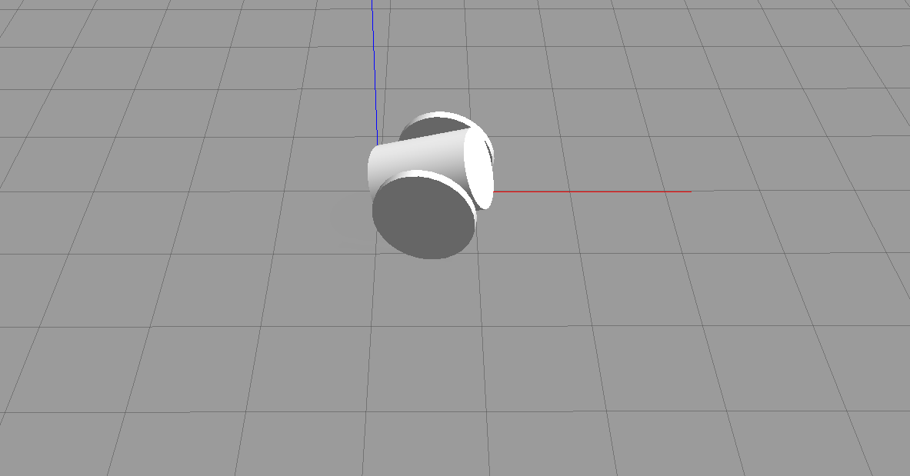

# 내 로봇을 Gazebo에 올리기 (문제5)

---

## 1. 배경

문제2~3에서 만든 URDF 로봇은 RViz2에서는 잘 보였지만, RViz2는 물리 연산이 없으므로 `<visual>` 태그만으로 충분했다. Gazebo는 다르다 — 물리 엔진이 로봇을 "실제 물체"로 다루려면 **충돌 영역**과 **질량 분포** 정보가 반드시 필요하다. 이번 문제에서는 URDF에 물리 속성을 추가하고, 로봇을 Gazebo 월드에 배치(spawn)한다.

---

## 2. `<collision>`과 `<inertial>` 태그

### 2.1 충돌 속성 `<collision>`

로봇이 바닥·장애물·다른 링크와 부딪힐 때 물리 엔진이 사용하는 **물리적 외형**이다. 화면에 그려지는 `<visual>`과 별개로 정의한다.

- `<visual>`에는 복잡한 메시(STL/DAE)를 쓰더라도, `<collision>`에는 Box·Cylinder·Sphere 같은 기본 도형을 쓰는 것이 관례다. 충돌 연산 비용이 크게 줄어 시뮬레이션 성능에 유리하다.

### 2.2 관성 속성 `<inertial>`

물리 엔진(ODE 등)이 뉴턴-오일러 방정식을 풀기 위해 요구하는 필수 데이터다.

- **질량** `<mass value="..."/>` — 링크의 무게(kg)
- **질량 중심** `<origin xyz="..." rpy="..."/>` — 기하학적 중심이 아닌 실제 무게 중심(CoM) 위치
- **관성 텐서** `<inertia .../>` — 회전 운동에 대한 저항을 나타내는 3×3 대칭 행렬. 대칭성 덕분에 6개 성분만 적는다.

$$I = \begin{bmatrix} i_{xx} & i_{xy} & i_{xz} \\ i_{xy} & i_{yy} & i_{yz} \\ i_{xz} & i_{yz} & i_{zz} \end{bmatrix}$$

주요 축이 질량 중심과 일치한다고 가정하면 교차 성분($i_{xy}, i_{xz}, i_{yz}$)은 0으로 둔다.

### 2.3 기본 도형의 관성 모멘트 공식

적당히 현실적인 값을 넣기 위해 균질 강체의 공식을 사용했다.

**상자** (가로 $w$, 세로 $d$, 높이 $h$, 질량 $m$):

$$i_{xx} = \tfrac{1}{12}m(d^2+h^2),\quad i_{yy} = \tfrac{1}{12}m(w^2+h^2),\quad i_{zz} = \tfrac{1}{12}m(w^2+d^2)$$

**원기둥** (반지름 $r$, 높이 $h$, 질량 $m$, 축이 z 방향):

$$i_{xx} = i_{yy} = \tfrac{1}{12}m(3r^2+h^2),\quad i_{zz} = \tfrac{1}{2}mr^2$$

### 2.4 URDF 확장 예시

기존 로봇의 각 링크를 아래 구조로 확장했다.

```xml
<link name="base_link">
  <visual>
    <geometry><box size="0.5 0.3 0.1"/></geometry>
  </visual>

  <collision>
    <origin xyz="0 0 0" rpy="0 0 0"/>
    <geometry><box size="0.5 0.3 0.1"/></geometry>
  </collision>

  <inertial>
    <origin xyz="0 0 0" rpy="0 0 0"/>
    <mass value="5.0"/>
    <inertia ixx="0.0416" ixy="0.0" ixz="0.0" iyy="0.1083" iyz="0.0" izz="0.1333"/>
  </inertial>
</link>
```

(질량 5kg 상자에 위 공식을 대입: $i_{xx}=\frac{1}{12}\cdot5\cdot(0.3^2+0.1^2)=0.0416$ 등.)

---

## 3. ROS2와 Gazebo의 연동 및 로봇 배치(Spawn)

### 3.1 연동 아키텍처

ROS2와 Gazebo는 `gazebo_ros_pkgs` 메타 패키지를 통해 통신한다.

- Gazebo는 독립적인 물리 시뮬레이터로 자체 내부 인터페이스를 가진다.
- `gazebo_ros` 패키지의 **플러그인들**이 다리 역할을 한다: Gazebo 내부 데이터(센서 값, 조인트 상태)를 ROS2 토픽(`/odom`, `/scan`, `/tf`)으로 변환하고, ROS2의 제어 명령(`/cmd_vel`)을 Gazebo 물리 엔진에 전달한다.

### 3.2 로봇 배치 흐름

1. `robot_state_publisher` 노드가 URDF(xacro)를 읽어 `robot_description` 토픽으로 발행한다.
2. `gazebo_ros` 패키지의 **`spawn_entity.py`** 노드를 실행하면서 그 토픽(또는 파일 경로)을 인자로 넘기면, Gazebo 월드에 로봇 엔티티가 생성된다.

```bash
ros2 run gazebo_ros spawn_entity.py -topic robot_description -entity my_robot
```

---

## 4. Gazebo 플러그인과 차동 구동 컨트롤러

### 4.1 Gazebo 플러그인이란

Gazebo 플러그인은 시뮬레이터 기능(물리 바인딩, 센서 데이터 생성, 모터 제어 등)을 동적으로 확장하는 공유 라이브러리다. URDF 안에 `<gazebo>` 태그로 선언한다.

플러그인이 없으면 URDF 모델은 시뮬레이터 안에서 물리 법칙을 따르는 "인형"에 불과하다. **바퀴를 굴리거나 센서 값을 ROS로 받으려면 반드시 플러그인이 필요하다.**

### 4.2 차동 구동 컨트롤러 `libgazebo_ros_diff_drive.so`

좌우 두 구동 바퀴를 가진 모바일 로봇을 위한 표준 플러그인이다. `geometry_msgs/msg/Twist` 타입의 **`/cmd_vel`** 토픽을 구독해 로봇을 움직이고, 오도메트리를 발행한다. 우리 라인트레이서 운반 로봇이 정확히 이 구동 방식(문제6에서 다룬 차동 구동)이다.

URDF 하단에 다음과 같이 선언했다.

```xml
<gazebo>
  <plugin name="differential_drive_controller" filename="libgazebo_ros_diff_drive.so">
    <update_rate>30</update_rate>

    <left_joint>left_wheel_joint</left_joint>
    <right_joint>right_wheel_joint</right_joint>

    <wheel_separation>0.35</wheel_separation>
    <wheel_diameter>0.15</wheel_diameter>
    <max_wheel_torque>20</max_wheel_torque>
    <max_wheel_acceleration>1.0</max_wheel_acceleration>

    <command_topic>cmd_vel</command_topic>
    <odometry_topic>odom</odometry_topic>
    <odometry_frame>odom</odometry_frame>
    <robot_base_frame>base_footprint</robot_base_frame>

    <publish_odom>true</publish_odom>
    <publish_odom_tf>true</publish_odom_tf>
    <publish_wheel_tf>true</publish_wheel_tf>
  </plugin>
</gazebo>
```

`wheel_separation`(바퀴 간 거리)과 `wheel_diameter`(바퀴 지름)는 URDF의 실제 치수와 일치시켜야 한다. 이 값이 틀리면 같은 `/cmd_vel`을 주어도 실제 회전 반경·주행 거리가 명령과 어긋난다 — 문제6(차동 구동 기구학)에서 계산한 그 파라미터들이다.

---

## 5. 제어 노드 구현 — `circle_drive_node.py`

로봇이 적당한 크기의 원을 그리며 돌도록, diff_drive 플러그인이 구독하는 `/cmd_vel`에 일정한 선속도·각속도를 계속 발행하는 제어 노드를 구현했다.

```python
import rclpy
from rclpy.node import Node
from geometry_msgs.msg import Twist

class circle_drive_node(Node):
    def __init__(self):
        super().__init__('circle_drive_node')
        self.wheel_pub = self.create_publisher(Twist, '/cmd_vel', 30)
        self.timer = self.create_timer(0.1, self.timer_callback)  # 10Hz

    def timer_callback(self):
        msg = Twist()
        msg.linear.x = 0.5   # 선속도 v (m/s)
        msg.angular.z = 0.5  # 각속도 ω (rad/s)
        self.wheel_pub.publish(msg)
```

선속도 $v$와 각속도 $\omega$를 함께 주면 로봇은 반지름 $r = v/\omega$의 원을 그린다 — ex6(차동 구동)에서 정리한 관계식이 그대로 적용된다.

### 5.1 Launch File과 패키지 설정

런치 파일(`gazebo_robot.launch.py`)은 다음 순서로 노드를 실행한다.

1. Gazebo 시뮬레이터 실행 (`gzserver` + `gzclient`)
2. `robot_state_publisher` — xacro를 읽어 `robot_description` 발행
3. `spawn_entity.py` — 그 토픽을 받아 Gazebo에 로봇 생성
4. `circle_drive_node` — 스폰된 로봇에 `/cmd_vel` 발행 시작

`setup.py`의 `entry_points`에 `circle_drive_node`를 등록하고, `data_files`에 launch·urdf 디렉토리를 추가했으며, `package.xml`에 의존성을 반영했다.

### 5.2 빌드 및 실행 결과

```bash
cd ~/sw_ws && colcon build --symlink-install
source install/setup.bash
ros2 launch my_robot_sim gazebo_robot.launch.py
```



---

## 첨부

- `sw_ws.tar.gz` — 워크스페이스 소스 압축본
- `gazebo_robot_spawn.png` — Gazebo에 배치된 로봇 주행 화면
