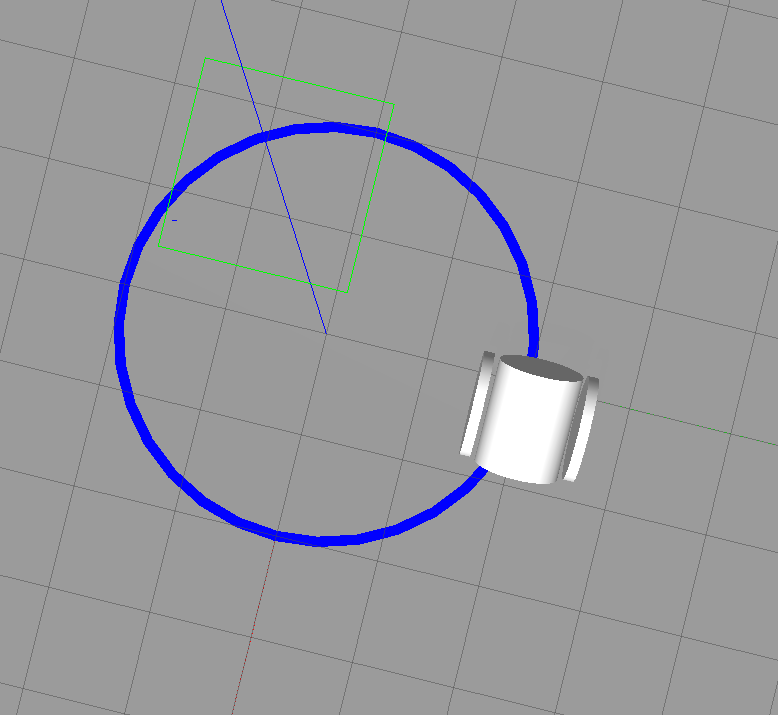

# Gazebo 환경(World) 구성 (문제6)

---

## 1. Gazebo 환경 파일이란

Gazebo에서 로봇이 움직이는 가상 공간(지면, 조명, 건물, 장애물 등)을 정의하는 파일을 **월드(World) 파일**이라고 한다.

- **형식:** XML 기반의 **SDF(Simulation Description Format)**, 확장자는 `.world`
- **주요 구성 요소:**
  - `<physics>` — 중력의 방향·크기($-9.81\,m/s^2$), 물리 연산 타임 스텝 등
  - `<light>` — 태양광(directional), 포인트 광원 등
  - `<include>` — 기본 지면(`ground_plane`)이나 외부 SDF 모델 불러오기
  - `<model>` — 월드에 고정 배치할 물체(우리 실습에서는 바닥의 라인 경로)
  - `<plugin>` — 월드 수준의 제어·모니터링 스크립트

로봇을 기술하는 URDF와 달리, 월드 파일은 "로봇이 아닌 나머지 세계 전부"를 기술한다. 라인트레이싱 실습에서는 **바닥에 그려진 라인 경로 자체가 월드의 일부**다.

---

## 2. 시뮬레이션 환경을 구축하는 방법들

| 방법 | 특징 | 주요 용도 |
| --- | --- | --- |
| **텍스트 에디터로 직접 작성** | SDF(XML)를 직접 작성. 수치·물리 설정을 완전히 제어할 수 있으나 시각적 배치가 어려움 | 정밀한 물리 설정, 단순한 경로·장애물 배치 |
| **Gazebo GUI 도구** | `Building Editor`, `Model Editor`로 드래그 앤 드롭 배치. 직관적이고 빠름 | 실내 구조, 미로·방 설계 |
| **3D 모델링 툴 연동** | Blender·CAD 등에서 만든 모델을 `.dae`/`.stl`로 내보내 SDF로 감싸기 | 복잡한 지형, 정교한 환경 |
| **알고리즘 기반 자동 생성** | Python 스크립트로 장애물·지형을 규칙/무작위 생성 | SLAM·내비게이션 학습용 랜덤 맵 |

이번 실습의 원형 라인 경로는 첫 번째 방법(SDF 직접 작성)으로 만들었다 — 반지름과 선 폭을 수치로 정확히 지정해야 하기 때문이다.

---

## 3. 월드 좌표계와 로컬 좌표계

### 3.1 월드 좌표계 (World / Global)

- 시뮬레이션 공간 전체의 **절대 기준**이 되는 고정 좌표계.
- 절대 변하지 않는 원점 $(0,0,0)$을 가지며, 맵 전체의 절대 방향을 정의한다.
- 로봇의 참값 위치(Ground Truth)를 말할 때의 기준이다.

### 3.2 로컬 좌표계 (Local / Body)

- 로봇 본체나 특정 링크(`base_link`, 센서 링크 등)의 **중심을 원점으로 하는 상대 좌표계**.
- 로봇이 움직이면 로컬 좌표계도 함께 움직인다.
- ROS 표준 방향: **X = 전방, Y = 좌측, Z = 상단**.

### 3.3 두 좌표계의 관계 — 동차 변환

로봇이 월드 안에서 움직일 때 두 좌표계 사이의 관계는 **이동(translation) + 회전(rotation)** 의 조합, 즉 동차 변환 행렬로 표현된다.

- 로봇의 IR 센서가 "로컬 좌표 기준으로 전방 0.2m 아래 바닥"을 본다면, 시뮬레이터는 로봇의 현재 자세(Pose)를 나타내는 변환 행렬을 곱해 그 지점의 **월드 좌표**를 구한다.
- 위치는 $(x, y, z)$로, 회전은 짐벌 락(Gimbal Lock)을 피하기 위해 **쿼터니언** $(x, y, z, w)$로 표현하는 것이 ROS 관례다.

문제1에서 배운 TF가 바로 이 변환들을 트리로 관리하는 체계다: `world(odom) → base_link → 각 센서 링크`.

---

## 4. 환경 파일과 함께 시뮬레이터 실행하기

### 방법 1 — CLI에서 직접 실행

```bash
# 기본 제공 empty.world
gazebo /usr/share/gazebo-11/worlds/empty.world

# 직접 만든 월드 (--verbose로 에러 로그 확인)
gazebo --verbose ~/sw_ws/src/my_robot_sim/worlds/circle_line.world
```

### 방법 2 — ROS2 Launch 스크립트 (권장)

`gazebo_ros`의 `gzserver`/`gzclient` 런치를 포함시키고, 월드 경로를 아규먼트로 전달한다.

```python
import os
from launch import LaunchDescription
from launch.actions import IncludeLaunchDescription
from launch.launch_description_sources import PythonLaunchDescriptionSource
from launch_ros.substitutions import FindPackageShare

def generate_launch_description():
    pkg_gazebo_ros = FindPackageShare(package='gazebo_ros').find('gazebo_ros')
    pkg_my_robot = FindPackageShare(package='my_robot_sim').find('my_robot_sim')
    world_path = os.path.join(pkg_my_robot, 'worlds', 'circle_line.world')

    start_gazebo_server = IncludeLaunchDescription(
        PythonLaunchDescriptionSource(
            os.path.join(pkg_gazebo_ros, 'launch', 'gzserver.launch.py')),
        launch_arguments={'world': world_path}.items()
    )

    start_gazebo_client = IncludeLaunchDescription(
        PythonLaunchDescriptionSource(
            os.path.join(pkg_gazebo_ros, 'launch', 'gzclient.launch.py'))
    )

    return LaunchDescription([
        start_gazebo_server,
        start_gazebo_client,
    ])
```

---

## 5. 원형 경로 월드 제작 및 로봇 배치

### 5.1 원형 경로 월드 (`circle_world.world`)

평탄한 바닥(`ground_plane`) 위에 원형 라인 경로를 SDF로 작성했다. 라인은 반지름이 살짝 다른 두 원판(외곽 2.05m, 내부 1.95m)을 겹쳐 만든 **폭 0.1m, 중심 반지름 약 2.0m의 고리**다. 이 크기는 **문제5의 제어 노드가 그리는 원과 맞춘 것**이다 — `circle_drive_node`는 $v=0.5$, $\omega=0.5$를 발행하므로 이론상 $r = v/\omega$의 원을 그리며, 시뮬레이션 상 실제 주행 궤적을 확인하면서 경로 반지름을 조정했다.

### 5.2 로봇 초기 위치·방향 배치

로봇의 초기 위치는 스폰 시점에 지정한다. 런치 파일에서 `spawn_entity.py`에 좌표 인자를 넘긴다.

```python
node_spawn_entity = Node(
    package='gazebo_ros',
    executable='spawn_entity.py',
    arguments=[
        '-topic', 'robot_description',
        '-entity', 'my_first_robot',
        '-x', '0.5', '-y', '2.0', '-z', '0.1',  # 원형 라인 위의 한 점
    ],
)
```

처음에는 로봇이 라인에서 벗어난 원을 그렸고, 스폰 좌표와 진행 방향을 시뮬레이션 결과를 보며 몇 차례 조정해 로봇의 주행 원과 라인 경로가 겹치도록 맞췄다.

### 5.3 반복 주행 런치 구성

런치 파일(`gazebo_robot_world.launch.py`)은 ① Gazebo를 `circle_world.world`와 함께 실행 → ② `robot_state_publisher` → ③ `spawn_entity.py`로 로봇 배치 → ④ `circle_drive_node` 실행 순서로 구성했다. 제어 노드는 타이머로 `/cmd_vel`을 계속 발행하므로, 시뮬레이션이 시작되면 사용자가 중단(`Ctrl+C`)할 때까지 로봇이 경로 위를 반복해서 돈다.

---

## 6. 실행 결과

바닥에 원형 라인 경로를 배치한 월드 위에서 로봇이 라인을 따라 원을 그리며 도는 것을 확인했다. 다음 문제(3-7)에서는 이 라인을 IR 센서로 감지해 능동적으로 따라가게 된다.



---

## 첨부

- `sw_ws.tar.gz` — 워크스페이스 소스 압축본 (월드 파일 포함)
- `gazebo_circle_world.png` — 원형 라인 월드에 로봇을 배치한 화면
