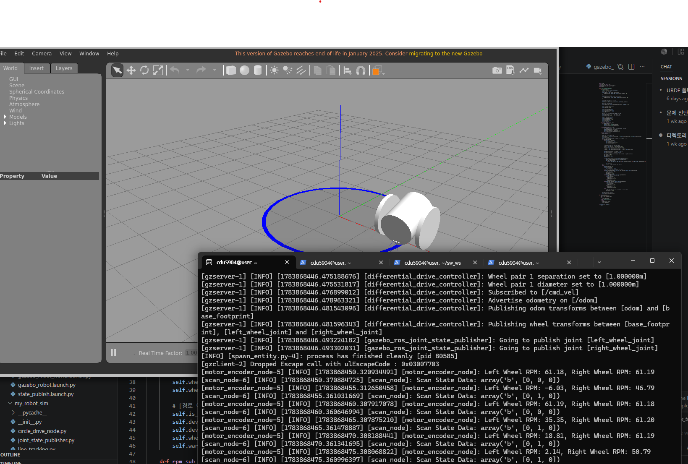
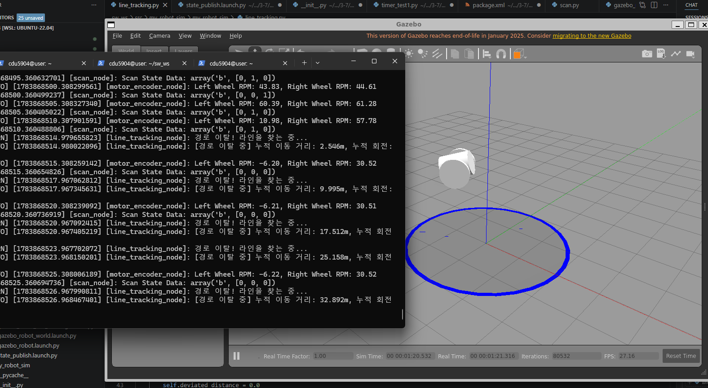

# 라인트레이싱 — 센서 기반 폐쇄 루프 제어 (문제7)

---

## 1. 목표

로봇에 모터·엔코더(바퀴 조인트)와 IR 센서 3개를 추가하고, **IR 센서 값 → 판단 → 모터 명령**으로 이어지는 폐쇄 루프(closed loop)를 구현한다. 원형 라인 경로(문제6의 월드)를 따라가게 하고, 경로를 벗어나면 엔코더 값으로 그동안의 이동 거리·회전량을 계산한다. 과정1에서 조사만 했던 IR 센서(ex4)·엔코더(ex5)·차동 구동(ex6)이 처음으로 하나의 제어 루프로 합쳐지는 문제다.

---

## 2. URDF 조인트 추가

### 2.1 바퀴 조인트 — 모터·엔코더 역할

별도의 액추에이터 태그 없이 좌우에 `continuous` 조인트를 둔다. Gazebo 차동 구동 플러그인이 이 조인트를 직접 굴리고(**모터** 기능), 실제 회전한 값을 읽어 상태로 발행한다(**엔코더** 기능).

```xml
<joint name="left_wheel_joint" type="continuous">
  <parent link="base_link"/>
  <child link="left_wheel_link"/>
  <origin xyz="0 0.15 0" rpy="-1.5708 0 0"/>
  <axis xyz="0 0 1"/>
</joint>

<joint name="right_wheel_joint" type="continuous">
  <parent link="base_link"/>
  <child link="right_wheel_link"/>
  <origin xyz="0 -0.15 0" rpy="-1.5708 0 0"/>
  <axis xyz="0 0 1"/>
</joint>
```

### 2.2 IR 센서 고정 조인트 3개 (Left · Center · Right)

로봇 전면 하단에서 **바닥을 수직으로 내려다보도록** 피치를 90° 준(`rpy="0 1.5708 0"`) `fixed` 조인트 3개를 추가한다. 좌우 센서는 중앙에서 ±5cm 간격 — ex4에서 조사한 "라인 폭보다 약간 넓은 센서 간격" 배치를 그대로 반영했다.

```xml
<joint name="ir_left_joint" type="fixed">
  <parent link="base_link"/>
  <child link="ir_left_link"/>
  <origin xyz="0.2 0.05 0.01" rpy="0 1.5708 0"/>
</joint>

<joint name="ir_center_joint" type="fixed">
  <parent link="base_link"/>
  <child link="ir_center_link"/>
  <origin xyz="0.2 0.0 0.01" rpy="0 1.5708 0"/>
</joint>

<joint name="ir_right_joint" type="fixed">
  <parent link="base_link"/>
  <child link="ir_right_link"/>
  <origin xyz="0.2 -0.05 0.01" rpy="0 1.5708 0"/>
</joint>
```

---

## 3. Gazebo 플러그인

### 3.1 차동 구동·엔코더 — `libgazebo_ros_diff_drive.so`

모터와 엔코더 하드웨어를 소프트웨어로 통합 대체한다.

- **모터 모사:** `/cmd_vel`(선속도·각속도)을 구독해 좌우 바퀴 조인트에 회전력을 인가한다.
- **엔코더 모사:** 바퀴 조인트가 실제로 회전한 각도·속도를 역산해 오도메트리(`/odom`)와 조인트 상태(`/joint_states`)를 발행한다.

### 3.2 레이저 기반 IR 센서 — `libgazebo_ros_ray_sensor.so`

적외선 반사형 IR 센서를 **바닥으로 쏘는 짧은 단일 레이저 빔**으로 모사한다. 바닥 라인(어두운 텍스처) 위인지 아닌지에 따라 반사 강도(intensity) 값이 달라지는 특성을 이용해 라인 감지 상태를 토픽으로 발행한다. 실물 IR 센서의 "검은 라인 = 반사량 감소" 원리를 시뮬레이터 안에서 재현한 것이다.

---

## 4. 노드 구성과 주행 규칙

### 4.1 데이터 흐름 (폐쇄 루프)

```
 IR 센서 토픽 3개          /scan_state            /cmd_vel
(/ir_sensor/left 등) ──→ [scan.py] ──→ [line_tracking.py] ──→ Gazebo diff_drive
                                              ↑                      │
                              motor_rpm       │                      │ /joint_states
                                  [motor_encoder.py] ←───────────────┘
```

- **`scan.py`** — 3개 IR 센서의 `intensities`가 임계값(500)을 넘으면 감지(1)로 판정, `[좌, 중, 우]` 배열을 `/scan_state`로 발행
- **`motor_encoder.py`** — `/joint_states`에서 좌우 바퀴 위치를 받아 회전 속도(RPM)를 계산해 `motor_rpm`으로 발행 (엔코더 역할)
- **`line_tracking.py`** — `/scan_state`와 `motor_rpm`을 구독해 주행 규칙대로 `/cmd_vel` 발행 (제어기 역할)

센서 → 제어기 → 구동기 → (로봇 상태 변화) → 다시 센서로 이어지므로 **폐쇄 루프**다. ex7에서 조사한 "피드백 제어"의 최소 구현이며, 다만 이 단계에서는 아직 PID가 아니라 규칙 기반(rule-based) 제어다.

### 4.2 주행 규칙

| 센서 상태 (좌/중/우) | 판단 | 동작 |
| --- | --- | --- |
| 중앙만 감지 | 라인 중앙 정렬 | 직진 (0.5 m/s) |
| 왼쪽 감지 | 로봇이 오른쪽으로 치우침 | 왼쪽으로 회전 |
| 오른쪽 감지 | 로봇이 왼쪽으로 치우침 | 오른쪽으로 회전 |
| 모두 미감지 | **경로 이탈** | 천천히 회전하며 라인 재탐색 + 엔코더로 이동량 누적 |

### 4.3 경로 이탈 시 엔코더 기반 이동량 계산

경로를 벗어난 순간부터 좌우 바퀴 RPM을 각속도로 환산하고, ex6의 차동 구동 기구학 공식으로 로봇 중심의 선속도·각속도를 구해 적분한다.

$$\omega_{wheel} = \frac{2\pi \cdot RPM}{60}, \qquad v = \frac{r(\omega_R + \omega_L)}{2}, \qquad \omega = \frac{r(\omega_R - \omega_L)}{L}$$

($r$: 바퀴 반지름, $L$: 바퀴 간 거리)

매 주기(30Hz)마다 $v \cdot dt$, $\omega \cdot dt$를 누적하면 이탈 후의 이동 거리와 회전 각도가 된다. 실제 코드의 해당 부분:

```python
# 오도메트리 기반 누적 거리/각도 계산
w_left = self.rpm_left * 2.0 * math.pi / 60.0
w_right = self.rpm_right * 2.0 * math.pi / 60.0

v_center = self.wheel_radius * (w_right + w_left) / 2.0
w_center = self.wheel_radius * (w_right - w_left) / self.wheel_tread

self.deviated_distance += v_center * self.dt
self.deviated_angle += w_center * self.dt
```

전체 소스는 첨부한 `scan.py`, `motor_encoder.py`, `line_tracking.py` 참조.

---

## 5. 실행 결과

- 원형 경로에서 IR 센서 감지 상태에 따라 로봇이 라인을 따라 주행하는 것을 확인했다.
- 라인을 강제로 벗어나게 하면 "경로 이탈!" 경고와 함께 누적 이동 거리·회전 각도가 로그로 출력되고, 천천히 회전하며 라인을 다시 찾는다.





---

## 6. 한계 — 다음 문제로

규칙 기반 제어는 "치우침의 방향"만 보고 "치우침의 크기"를 보지 않는다. 회전량이 항상 같으므로 커브에서 덜 꺾이거나 과하게 꺾여 좌우로 출렁인다. 이 문제를 해결하는 것이 다음 문제(3-8)의 PID 제어다.

---

## 첨부

- `sw_ws.tar.gz` — 워크스페이스 소스 압축본
- `scan.py` — IR 센서 → 감지 상태 발행 노드
- `motor_encoder.py` — 바퀴 조인트 → RPM 발행 노드
- `line_tracking.py` — 주행 규칙 제어 노드
- `line_tracking.png` — 라인 추종 주행 화면
- `course_deviation.png` — 경로 이탈 시 이동량 계산 화면
