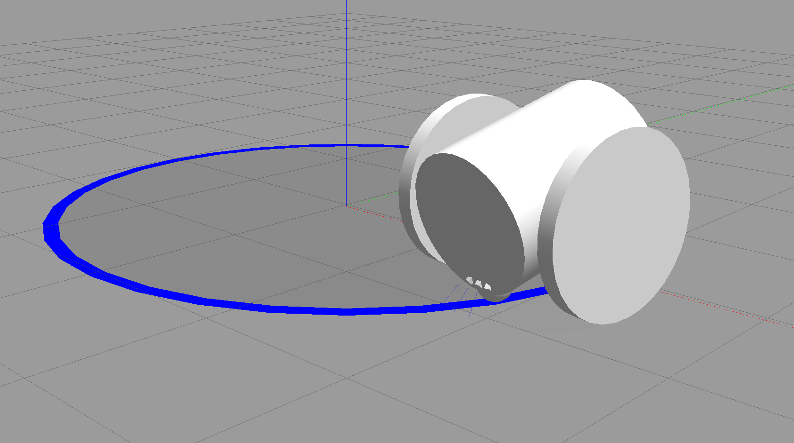

# PID 제어 라인트레이싱 (문제8)

---

## 1. 목표

센서 값으로 오차(error)를 계산하고, 그 오차로부터 P·I·D 세 항을 구해 모터 제어 신호를 만드는 **PID 라인트레이싱**을 구현한다. 규칙 기반이었던 문제7과의 차이를 비교한다. ex7(PID 제어 조사)에서 이론으로 정리했던 내용을 실제 제어 코드로 옮기는 문제다.

---

## 2. PID 제어 복습

PID는 목표값과 현재값의 차이(오차)를 줄이도록 제어 신호를 만드는 방법이며, 세 항의 합이 최종 출력이다.

$$u(t) = K_p \, e(t) + K_i \int e(t)\,dt + K_d \frac{de(t)}{dt}$$

- **P (비례):** 현재 오차에 비례해 반응한다. 빠르지만 P만 쓰면 목표 근처에서 진동하거나 정상상태 오차가 남는다.
- **I (적분):** 오차를 시간에 걸쳐 누적한다. 오래 남는 작은 오차(정상상태 오차)를 없애지만, 과하면 누적값이 부풀어 오버슛·진동을 만든다.
- **D (미분):** 오차의 변화율에 반응해 급변을 미리 누른다. 진동을 줄이고 안정화하지만, 과하면 센서 잡음에 민감해진다.

---

## 3. 센서 값으로 오차 계산하기

IR 센서 3개는 on/off 값만 주므로, 이를 하나의 연속적인 오차 숫자로 바꿔야 PID에 넣을 수 있다. 각 센서에 위치 가중치를 부여한다 — **왼쪽 −1, 중앙 0, 오른쪽 +1** — 그리고 감지된 센서들의 가중치 평균을 오차로 정의한다.

| 감지 상태 (좌/중/우) | error | 해석 |
| --- | --- | --- |
| 0 / 1 / 0 | 0.0 | 중앙 정렬 |
| 0 / 1 / 1 | +0.5 | 라인이 약간 오른쪽 |
| 0 / 0 / 1 | +1.0 | 라인이 많이 오른쪽 |
| 1 / 1 / 0 | −0.5 | 라인이 약간 왼쪽 |
| 1 / 0 / 0 | −1.0 | 라인이 많이 왼쪽 |

- `error > 0` → 라인이 오른쪽 → 오른쪽으로 회전해야 함
- `error < 0` → 라인이 왼쪽 → 왼쪽으로 회전해야 함

이 오차를 PID에 넣어 나온 출력을 `angular.z`(회전 속도)로 쓰고, `linear.x`(직진 속도)는 고정한다. on/off 센서 3개만으로도 5단계의 오차 해상도가 나오므로, 문제7의 3단계 규칙보다 훨씬 섬세한 제어가 가능해진다.

---

## 4. 파라미터 초기값

실제 튜닝은 다음 문제(3-9)에서 진행하고, 이번에는 아래 시작값을 사용했다.

| 파라미터 | 초기값 | 역할 |
| --- | --- | --- |
| $K_p$ | 1.0 | 편차에 비례한 기본 회전 |
| $K_i$ | 0.1 | 누적 편차 보정 (작게 시작) |
| $K_d$ | 0.6 | 진동 억제 |
| base_speed | 0.5 | 고정 직진 속도 (m/s) |

안전장치 두 가지를 함께 넣었다.

- **출력 제한:** `angular.z`를 (−1.5, 1.5)로 클램프해 출력이 튀는 것을 방지
- **적분 리셋:** 라인을 잃었다가 다시 잡을 때 `reset()`으로 적분 항을 초기화 — 이탈 중 쌓인 적분값이 재진입 순간 출력을 튀게 하는 것(적분 와인드업의 일종)을 방지

---

## 5. 구현 핵심부

단순한 이산시간 PID 클래스를 만들고, 타이머 콜백(30Hz)에서 센서 오차를 넣어 `/cmd_vel`을 발행한다. 전체 소스는 첨부한 `line_tracking_pid.py` 참조.

```python
class PID:
    """단순한 이산시간 PID 컨트롤러"""

    def __init__(self, kp, ki, kd, output_limit):
        self.kp, self.ki, self.kd = kp, ki, kd
        self.output_limit = output_limit  # (min, max)
        self.integral = 0.0
        self.prev_error = 0.0
        self.prev_error_valid = False  # 첫 스텝에서 미분값 튀는 것 방지

    def reset(self):
        self.integral = 0.0
        self.prev_error = 0.0
        self.prev_error_valid = False

    def compute(self, error, dt):
        self.integral += error * dt

        if self.prev_error_valid:
            derivative = (error - self.prev_error) / dt
        else:
            derivative = 0.0
            self.prev_error_valid = True

        output = (self.kp * error) + (self.ki * self.integral) + (self.kd * derivative)
        output = max(self.output_limit[0], min(self.output_limit[1], output))

        self.prev_error = error
        return output
```

오차 계산부:

```python
def compute_line_error(self):
    weight_sum, count = 0.0, 0
    if self.left_detected:   weight_sum += -1.0; count += 1
    if self.center_detected: weight_sum +=  0.0; count += 1
    if self.right_detected:  weight_sum += +1.0; count += 1
    if count == 0:
        return None  # 라인 완전 소실 → 별도 탐색 로직에서 처리
    return weight_sum / count
```

경로를 완전히 잃었을 때는 문제7과 같은 엔코더 기반 이동량 누적을 유지하되, **라인을 잃기 직전 오차의 부호**를 기억해 그 방향으로 회전하며 탐색하도록 개선했다 (문제7은 항상 한쪽 방향으로만 탐색했다).

```python
search_dir = 1.0 if self.last_error >= 0 else -1.0
msg.linear.x = 0.1
msg.angular.z = 0.3 * search_dir
```

---

## 6. PID를 안 썼을 때(문제7)와의 비교

| 항목 | 규칙 기반 (문제7) | PID (문제8) |
| --- | --- | --- |
| 회전량 | 상태별 고정값 | 오차 크기에 비례해 연속적으로 조절 |
| 커브 주행 | 덜 꺾이거나 과하게 꺾여 좌우로 출렁임 | 부드럽게 추종, D 항이 진동을 억제 |
| 정상상태 오차 | 보정 수단 없음 | I 항이 누적 보정 |
| 라인 재탐색 | 고정 방향 회전 | 마지막 오차 부호를 따라 탐색 |

실제로 같은 원형 경로에서 규칙 기반 제어는 좌우로 지그재그를 그리며 주행했지만, PID 제어는 라인 중앙에 붙어 매끄럽게 주행했다.



---

## 첨부

- `sw_ws.tar.gz` — 워크스페이스 소스 압축본
- `line_tracking_pid.py` — PID 라인트레이싱 제어 노드
- `pid_linetracing.png` — PID 제어 주행 화면
