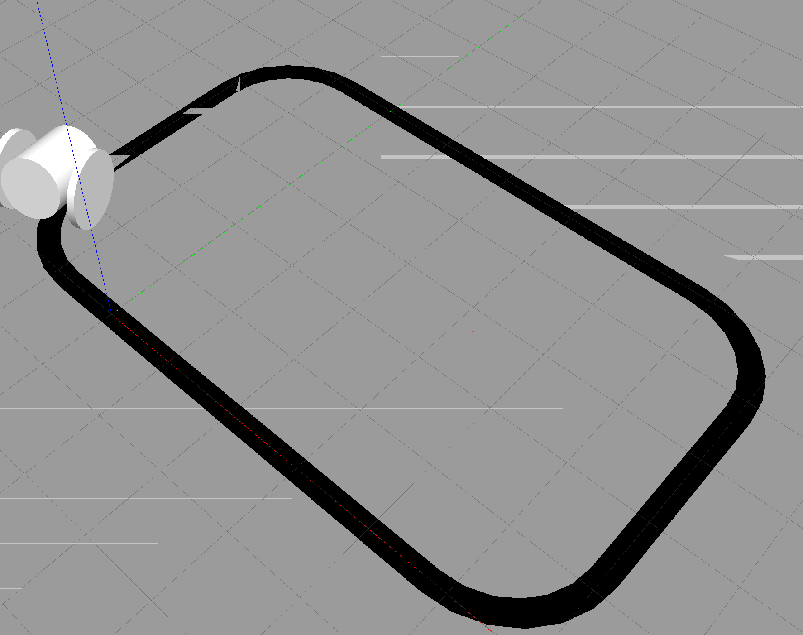

# PID 파라미터 튜닝 (문제9)

---

## 1. 목표

PID 튜닝 과정과 P·I·D 간 상호작용에서 주의할 점을 조사한다. $K_p$·$K_i$·$K_d$를 ROS2 파라미터로 선언해 **실행 중에 실시간으로 값을 바꾸며** 튜닝하고, 튜닝 전/후의 주행 성능을 원형 경로와 복잡한 경로에서 비교한다.

---

## 2. P·I·D 간의 상호작용과 주의점

세 게인은 독립적이지 않다. 하나를 키우면 다른 항의 효과도 달라지므로, **한 번에 하나씩, 조금씩** 바꾸는 것이 핵심이다.

| 파라미터 | 올리면 | 너무 크면 |
| --- | --- | --- |
| $K_p$ | 반응이 빨라짐, 정상상태 오차 감소 | 오버슛·진동 발생 |
| $K_i$ | 남아있는 오차 제거 | 적분 누적으로 오버슛·불안정 (적분 와인드업) |
| $K_d$ | 진동·오버슛 억제, 안정화 | 센서 잡음에 민감, 반응 둔화 |

주의할 조합:

- $K_p$를 너무 올린 상태에서 $K_i$까지 키우면 진동이 급격히 심해진다 — 둘 다 오차를 "밀어붙이는" 방향이기 때문이다.
- $K_d$는 잡음을 증폭할 수 있으므로 **마지막에** 조금씩 올린다. 특히 on/off IR 센서처럼 오차가 계단형으로 변하는 시스템에서는 미분값이 순간적으로 크게 튄다.

---

## 3. 대표적인 튜닝 방법

- **시행착오 (Trial and Error):** $K_p$부터 올려 반응을 보고, $K_d$·$K_i$를 차례로 조정. 가장 직관적이고 실무에서 많이 쓴다. 이번 실습도 이 방법을 사용했다.
- **지글러-니콜스 (Ziegler–Nichols):** $K_i = K_d = 0$으로 두고 $K_p$만 올려 시스템이 일정한 진폭으로 진동하기 시작하는 임계 게인($K_u$)과 진동 주기($T_u$)를 찾은 뒤, 공식으로 세 게인을 계산한다 (예: 고전 PID는 $K_p=0.6K_u$, $T_i=0.5T_u$, $T_d=0.125T_u$).
- **소프트웨어 자동 튜닝:** 오차 적분(IAE·ITAE 등) 같은 성능 지표를 최소화하도록 알고리즘이 게인을 탐색한다.

---

## 4. ROS2 파라미터로 실시간 튜닝

게인을 코드에 하드코딩하면 값을 바꿀 때마다 수정→재빌드→재실행을 반복해야 한다. **ROS2 파라미터**로 선언하면 노드 실행 중에 `ros2 param` 명령으로 즉시 바꿀 수 있어 튜닝 사이클이 극적으로 짧아진다.

### 4.1 노드 안에서 파라미터 선언

```python
self.declare_parameter('kp', 1.0)
self.declare_parameter('ki', 0.1)
self.declare_parameter('kd', 0.6)

self.kp = self.get_parameter('kp').value
self.ki = self.get_parameter('ki').value
self.kd = self.get_parameter('kd').value

# 변경 콜백 등록 — 파라미터가 바뀌면 내부 PID 계수에 즉시 반영
self.add_on_set_parameters_callback(self.on_param_change)
```

### 4.2 주행 중 터미널에서 값 확인·변경

```bash
# 현재 값 확인
ros2 param get /line_tracking_pid_node kp

# 실시간 변경 — 로봇이 달리는 채로 반영된다
ros2 param set /line_tracking_pid_node kp 1.4
ros2 param set /line_tracking_pid_node kd 0.8
```

---

## 5. 튜닝 순서 (적용한 절차)

1. **$K_i=0$, $K_d=0$으로 두고 $K_p$부터.** 라인을 따라가되 약간 진동이 남을 정도까지 올린다.
2. **$K_d$를 조금씩 올린다.** P 때문에 생긴 진동·오버슛을 눌러 안정화한다.
3. **마지막에 $K_i$를 조금씩 올린다.** 커브에서 계속 안쪽/바깥쪽으로 남는 정상상태 오차를 없앤다. 진동이 생기면 다시 줄인다.

---

## 6. 튜닝 전/후 성능 비교

### 6.1 원형 경로

- **튜닝 전:** 커브에서 좌우로 크게 출렁이고, 가끔 라인을 놓쳤다.
- **튜닝 후:** $K_p$를 적정선까지 올리고 $K_d$로 진동을 잡자 흔들림이 눈에 띄게 줄었고, 라인 중앙을 안정적으로 유지하며 돌았다.

### 6.2 복잡한 경로

직선과 곡률이 다른 커브가 섞인 복잡 경로 월드(`complex_path_world`)에서 비교했다.

- **튜닝 전:** 곡률이 급한 구간에서 반응이 따라가지 못해 이탈이 잦았다.
- **튜닝 후:** 급커브에서도 회전량이 오차 크기에 맞게 조절되어 경로를 훨씬 오래 유지했다.

테스트용 복잡 경로는 직선 구간(box)과 반지름이 다른 커브 구간(cylinder)을 SDF에서 pose로 이어 붙인 폐곡선이다.

```xml
<model name="complex_path">
  <static>true</static>
  <link name="path_surface">
    <!-- 직선 구간(box)과 커브 구간(cylinder)을 pose로 이어 붙임 -->
    <visual name="path_straight_1"> <!-- box 4.0 x 0.3 --> </visual>
    <visual name="path_curve_1">    <!-- cylinder r=2.0 --> </visual>
    <visual name="path_curve_2">    <!-- cylinder r=1.5 --> </visual>
  </link>
</model>
```



실제 라인트레이서 운반 로봇에서도 트랙(경로 곡률), 적재 하중(관성), 바닥 재질(마찰)이 바뀔 때마다 재튜닝이 필요하다. 이번에 구축한 "주행 중 `ros2 param set`으로 즉시 조정" 환경은 실물 튜닝에서도 그대로 쓸 수 있는 방식이다.

---

## 첨부

- `sw_ws.tar.gz` — 워크스페이스 소스 압축본 (파라미터화된 PID 노드, 복잡 경로 월드 포함)
- `pid_tuning.png` — 튜닝 후 주행 화면
